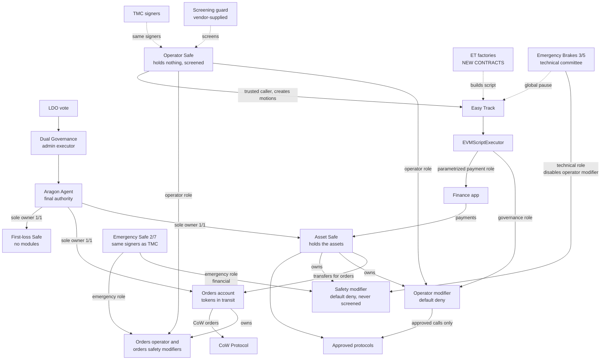

# LIP-XX: Active Treasury Management Vault

| LIP field | Value |
|---|---|
| lip | to be assigned |
| title | Active Treasury Management Vault |
| status | WIP |
| author | to be filled by proposers |
| discussions-to | a thread on https://research.lido.fi/, to be created |
| created | 2026-09-22 |

> **Where this draft stands.** It was written during the design review of 2026-09-10 to 2026-09-22 and moved into this repository on 2026-09-30. The [ADRs](/adr/index.md) record the decisions, and this draft must never contradict them [s2]. The chain facts that the ADRs rely on were re-read at block 26092572 [s3]. Any other chain fact in this draft is a claim from the design review that was not re-run. EM chose the screening route on 2026-10-02, and section 9.1 records it. EM chose the funding period and limit the same day, and section 5.2 records them. Open items are in the [open-decisions register](/registers/open-decisions.md).

> **Draft status.** Sections marked **[Implemented]** are built and covered by tests against deployed mainnet bytecode on a pinned fork. Sections marked **[Specified]** are designed but not built. Sections marked **[Open]** need a decision before this proposal can be finalised. No component has been deployed to mainnet. No audit has been performed.

## Simple Summary

Give the Treasury Management Committee a way to put a bounded slice of the DAO treasury to work in approved DeFi protocols, without ever letting it, or any service provider, take the assets. The DAO keeps ownership. An on-chain permission layer decides what the committee may do. An emergency Safe, held by the committee's own signers at a lower quorum, can pull everything back. The Emergency Brakes multisig can switch the operator off. Easy Track motions onboard protocols, inside templates fixed at audit time. Every removal is an immediate action of the emergency Safe.

## Abstract

We propose to deploy a Safe controlled solely by the Aragon Agent, and to attach two Zodiac Roles modifiers to it that enforce default-deny permissions. The **operator modifier** carries an **operator** role held by the Treasury Management Committee multisig and a **governance** role held by the Easy Track script executor. The **safety modifier** carries an **emergency** role held by a new Safe with a threshold of two and the same signer set as that committee, and a **technical** role held by the Emergency Brakes multisig.

All swapping, routine and emergency, is CoW orders placed from a dedicated orders account that the Aragon Agent owns. Each role's permissions pin the receiver: the Asset Safe for the operator, the Agent for recovery. Nothing on chain bounds an order's price; CoW's competition rules, screening, budgets and monitoring of each fill take its place. Easy Track motions onboard new protocols and assets and adjust budgets within ceilings. Every removal is the emergency Safe's immediate revoke. Motions never submit a permission tree. Each factory generates the tree itself from a fixed template, so the shape of every permission is decided at audit time and only its parameters arrive by motion.

The only new contracts are Easy Track EVM script factories. No bespoke access-control, vault, or accounting contract is introduced. Funding reuses the existing Finance application and allowed-recipients machinery already in production.

## Motivation

### Background

The DAO treasury holds idle assets. A [Treasury Management Committee](https://docs.lido.fi/multisigs/committees#25-treasury-management-committee) exists and, by the principles under which it was formed, never takes custody. Putting treasury assets to work therefore requires a system where the committee can transact but cannot possess, and where the DAO can reverse any of it.

### Problem

Three properties are needed at once and no existing Lido component provides them together.

1. **Custody must stay with the DAO.** The Aragon Agent must remain the only owner of the assets, and no provider outage, suspension, or contract termination may change that.
2. **Authority must be bounded before execution, not after.** A report-and-remediate control does not stop a transaction. The system must deny unapproved targets, functions, and parameters at execution time.
3. **Routine changes must not require a full DAO vote, and must still not be arbitrary.** Adding an approved strategy should be an Easy Track motion with an objection window. That motion must not be able to widen authority beyond what the DAO already approved.

A conventional multisig fails the second property. A provider-operated vault fails the first. Granting Easy Track general execution authority over the Agent fails the third, because it would let a motion forward any script as the Agent and would put the entire treasury behind a three-day objection window.

### Solution

Separate **custody**, **authority**, and **change control** into three layers that are already audited, and add only the thin glue that Easy Track's interface requires.

- Custody: a Safe owned one-of-one by the Aragon Agent.
- Authority: two Zodiac Roles modifiers enabled as modules on that Safe, with the Safe as their owner.
- Change control: Easy Track motions through purpose-built script factories, which build every permission from a template fixed at audit time.

## Specification

### Overview



Every role executes **as the Safe**. The modifier checks the call against that role's permissions, then calls `execTransactionFromModule` on the Safe. Because the Safe owns the modifier, a role can also be permitted to administer the modifier itself, which is how the emergency and governance roles work without anyone holding authority over the Agent.

### Rationale

**Why the Safe owns the modifier, rather than the Agent.** A role's call executes with the avatar's authority. If the avatar owns the modifier, a narrowly scoped role can perform administrative calls on the modifier without the Agent being involved. This is what lets the emergency committee revoke the operator in minutes, and what lets Easy Track change policy without ever holding Agent authority. It is a deviation from the naive layout where the Agent owns the modifier directly, and it is load-bearing.

**Why Easy Track never gets Agent authority.** At block 26092572 the Easy Track script executor holds neither `RUN_SCRIPT_ROLE` nor `EXECUTE_ROLE` on the Agent. Only the Dual Governance admin executor holds them [s3]. Granting the executor either role would make every Easy Track motion capable of forwarding arbitrary scripts as the Agent, which contradicts the requirement that Easy Track have no unrestricted execution authority. The governance role on the modifier gives exactly the needed power and nothing else.

**Why template factories instead of motion-authored permissions.** A permission in the modifier is a condition tree stored per role, target, and selector, and a write replaces that slot entirely rather than merging into it. If motions could submit trees, every motion would have to be checked on-chain for being strictly narrower than what it replaces, which is a tree-comparison problem nobody should solve under an objection window.

Template factories remove the problem without forcing a vote for every new protocol. A factory accepts a small, typed parameter set — a target address, an asset, a budget key — and builds the condition tree itself from a shape fixed in its own code. The operator can therefore onboard a protocol through an ordinary motion, and still cannot express a permission the template does not describe. What an audit reviews is the finite set of templates, not an open-ended space of trees.

**Why the emergency role is easier to reach than the operator role.** The emergency role can only reduce exposure: revoke, exit, and return assets to the Agent. Its powers point one way. A lower quorum on a one-way power shortens response time without widening what can be done with it. Since OD-43 one of these powers can also lose value: a recovery order has no on-chain price floor, and only CoW's rules hold its fill to the on-chain market (OD-48).

**Why no bespoke controller.** An earlier design used a purpose-built controller contract to hold an allowlist, a stale-motion counter, and budget ceilings. Each of those jobs turned out to be available without new code. Easy Track re-invokes the factory at enactment and requires the regenerated script to hash-match, so the factory's own allowlist doubles as the stale-motion rule. Budget ceilings and a refill-rate floor are expressible as native conditions. Escalation guards belong in the modifier. The controller was removed.

**Why every swap is a CoW order from a separate account.** A pre-signed exchange order is opaque to the permission layer: the sell token, buy token, amounts and receiver are committed inside a hash the modifier cannot read. CoW's order signer takes the typed order instead and computes the hash itself, so a permission can pin the tokens, the receiver and the order's life. TWAP and stop-loss orders need their owner to carry CoW's fallback handler, which the Asset Safe does not have, so a separate account owned by the Agent places them and holds only tokens in transit. The cost is the price bound: an order's limit is a number that the caller chooses, so the bound moves from the chain to screening, budgets and monitoring of each fill. The committee needs limit, TWAP and stop-loss orders, and the treasury swap contracts that this design used until 2026-10-06 offered none of them (OD-43).

**Why approvals spend the budget.** An approval snapshot is not a loss bound if the operator can restore it, and a spender can pull what it is approved for without any deposit call. Each approval to a protocol spender therefore spends the budget of the key that the spender serves, so approvals per key per period cannot exceed the budget, whatever the spender does (OD-08).

### Technical Specification

---

#### Part 1: Account graph **[Implemented in part]**

| Component | Address | Source |
| --- | --- | --- |
| Aragon Agent | `0x3e40D73EB977Dc6a537aF587D48316feE66E9C8c` | existing |
| Aragon ACL | `0x9895F0F17cc1d1891b6f18ee0b483B6f221b37Bb` | existing, resolved via `Agent.kernel().acl()` |
| Dual Governance admin executor | `0x23E0B465633FF5178808F4A75186E2F2F9537021` | existing |
| Finance application | `0xB9E5CBB9CA5b0d659238807E84D0176930753d86` | existing, `vault()` returns the Agent |
| Easy Track | `0xF0211b7660680B49De1A7E9f25C65660F0a13Fea` | existing |
| EVMScriptExecutor | `0xFE5986E06210aC1eCC1aDCafc0cc7f8D63B3F977` | existing |
| TMC multisig | `0xa02FC823cCE0D016bD7e17ac684c9abAb2d6D647` | existing, threshold 4 of 7; its signers also sign the Operator Safe and the Emergency Safe |
| Emergency Brakes multisig | `0x73b047fe6337183A454c5217241D780a932777bD` | existing, threshold 3 of 5; holds the **technical** role and the global Easy Track pause |
| **Emergency Safe** | to be deployed | new Safe v1.5.0 instance, **threshold 2**, owner set identical to the TMC multisig. No guard |
| Safe singleton v1.5.0 | `0xFf51A5898e281Db6DfC7855790607438dF2ca44b` | reused. `VERSION()` returns `1.5.0`, and the runtime codehash equals `0xdda019cbd7c867a533a2a86e5c53434fdc50b13122b5a5ddb4a8df61b31c20f2`, matching the published deployment record. Released 2025-07-03, audited by Certora and Ackee at pinned commits, covered by the Safe bug-bounty programme. The Asset Safe, the Operator Safe and the Emergency Safe use v1.5.0, by EM's decisions of 2026-10-02 and 2026-10-05 [s1]. The screening vendor's guard passed the same fork suite on v1.3.0, v1.4.1 and v1.5.0 [s6], and the vendor confirmed its support for v1.5.0, as EM reported on 2026-10-05. None of the six Lido Safes checked runs v1.5.0 today. Its record of holding value is short; see Security Considerations [s8] |
| Safe proxy factory v1.5.0 | `0x14F2982D601c9458F93bd70B218933A6f8165e7b` | reused |
| Zodiac Roles mastercopy | `0xF2964CE6161ce0e75964Fe7927cE114cb0B283D5` | reused, `owner()` is `0x…01`, i.e. locked |
| Zodiac ModuleProxyFactory | `0x000000000000aDdB49795b0f9bA5BC298cDda236` | reused |
| **Asset Safe** | to be deployed | new instance of the singleton. No guard and no fallback handler are set on it. The Aragon Agent authorizes its transactions only by `approveHash` or by sending them itself, never by a contract signature (OD-17) |
| **Operator Safe** | to be deployed | new Safe instance with the TMC signers. Holds no assets and no modules. Threshold 4 of 7. Holds the operator role, is the trusted caller of every factory, and carries the screening guard |
| **Operator modifier** | to be deployed | minimal proxy of the mastercopy. Carries the operator and governance roles. The operator role is held by the Operator Safe, whose transactions are screened |
| **Safety modifier** | to be deployed | minimal proxy of the mastercopy. Carries the emergency and technical roles, and the exit-governance role through which a motion adds an emergency exit (OD-49). Never screened |
| **Screening guard** | vendor-supplied | the screening vendor's existing transaction guard, one instance for the Operator Safe, set with `setGuard`. Not written by Lido |
| **Orders account** | to be deployed | new Safe instance owned by the Aragon Agent, one of one, with CoW's `ExtensibleFallbackHandler` at `0x2f55e8b20D0B9FEFA187AA7d00B6Cbe563605bF5` and ComposableCoW as the verifier of CoW's settlement domain. Holds only tokens in transit between a transfer and a fill. Its two modifiers split the roles as the Asset Safe's do (OD-43) [s11] |
| **First-loss Safe** | to be deployed | new Safe instance owned by the Aragon Agent, one of one, with no module, guard or fallback handler. Holds only the DAO's first-loss Earn shares; no role can reach them (OD-42) |
| CoW order signer | `0x23dA9AdE38E4477b23770DeD512fD37b12381FAB` | reused, verified `CowswapOrderSigner`; called by delegatecall from the orders account [s11] |
| ComposableCoW, TWAP and StopLoss handlers | `0xfdaFc9d1902f4e0b84f65F49f244b32b31013b74`, `0x6cF1e9cA41f7611dEf408122793c358a3d11E5a5`, `0x412c36e5011cd2517016d243a2dfb37f73a242e7` | reused; Ackee audited ComposableCoW and CoW's fallback handler, and Gnosis reviewed ComposableCoW; whether the two handlers are in those reports' scope is not checked [s11] |

The Emergency Safe, the Operator Safe, the orders account and the first-loss Safe are new instances of the audited Safe singleton, not new contract code. The Agent owns the orders account and the first-loss Safe. The Emergency Safe's and the Operator Safe's owner sets must be kept in step with the TMC multisig: a signer rotation on one is a rotation owed on all three, and that reconciliation is an operational duty with no on-chain enforcement.

**Deployment constraints.**

1. The Roles mastercopy keeps its own storage from slot 0. Deploying it behind a Safe proxy overwrites the proxy's implementation pointer with the avatar address and bricks the instance. It **must** be deployed through the Zodiac `ModuleProxyFactory`, which produces EIP-1167 minimal proxies that hold the implementation in bytecode.
2. The deployed mastercopy predates the current upstream source. Its initialiser is `setUp(bytes)` taking `abi.encode(owner, avatar, target)`, not the three-argument form. Audits and deployment tooling must pin the deployed bytecode, not repository HEAD.
3. `owner`, `avatar`, and `target` are all set to the Asset Safe.
4. The Asset Safe is set up with no fallback handler. Without one, it refuses ERC-721 and ERC-1155 safe transfers and cannot sign a message by EIP-1271. A protocol that needs either comes back to EM (OD-17).
5. The orders account is set up with CoW's fallback handler, and its domain verifier for CoW's settlement domain is ComposableCoW. Whether CoW's fallback handler works on Safe v1.5.0 is not checked yet; a fork test must show it before the account is relied on [s11].

#### Part 2: Roles and authority **[Implemented in part]**

Four principals. Role keys are `bytes32`; the encoding must match the tooling that applies the policy and is a deployment-time check.

| Role | Holder | May do | May not do |
| --- | --- | --- | --- |
| DAO | Aragon Agent, reached by vote through Dual Governance | Everything: owns the Safe, may replace the whole policy, may add or remove role members | — |
| `operator` | Operator Safe, the TMC signers, screened | Open, adjust, and close positions in approved protocols within budgets; approve approved spenders, each approval spending its spender's budget key or staying below a fixed ceiling (OD-08); stake ETH, and request and claim Lido withdrawals pinned to the Asset Safe; convert DAI to USDS and back through Sky's converter, pinned to the Asset Safe; fund the orders account under budgets and place CoW orders there that pay the Asset Safe (OD-43) | Transfer any asset out, except into the orders account; borrow; create debt; administer a modifier or a Safe; change its own permissions |
| `emergency` | Emergency Safe, two of seven, same signers as the operator. **Safety modifier** | Set approvals to zero; exit positions to the Safe; unwrap wstETH and WETH, stake ETH and redeem sUSDS; transfer assets to the Agent or to the orders account; on the orders account, cancel orders, send tokens to the Agent or the Asset Safe, and place recovery orders that buy USDC or USDT and pay the Agent; revoke the operator's targets and functions, which is how every removal happens | Add any permission; enter any protocol except by staking ETH; borrow; reach the first-loss Safe (OD-42); change the recovery destination; disable a module |
| `technical` | Emergency Brakes multisig, three of five. **Safety modifier**, and the orders account's safety modifier | Disable the **operator** modifier, or the orders account's operator modifier, with the module argument pinned, for a defect in the permission layer or for a cap breach that gets worse (OD-29) | Anything else. It cannot touch assets or permissions, and it cannot disable a safety modifier |
| `governance` | EVMScriptExecutor, driven by Easy Track | Write operator permissions from a fixed template, for a target named in a motion; set operator budgets within ceilings | Submit a condition tree; grant or remove any role; touch the emergency role; target the modifier's avatar or any of its modules; grant delegatecall |
| exit governance | EVMScriptExecutor, driven by Easy Track. **Safety modifier** | Write the emergency role's exit for a target that an onboarding motion names, from the same template: redeem, withdraw, claim and cancel pinned to the avatar, a transfer pinned to the Agent, an approval set to zero (OD-49) | Write anything but an exit; grant delegatecall; touch the technical role or membership; set an allowance; target the Asset Safe or any of its modules |

The emergency role's ability to revoke the operator works because the Safe owns the modifier: a call through the emergency role executes as the Safe, which the modifier accepts as its owner.

**Two classes of risk, and who answers each.**

*Financial risk* is the common case: a depeg, a dependency failure, a curator acting against the vault's interest, a position that must be unwound now. These need someone who watches the portfolio daily, understands the positions, and can act in minutes. That is the treasury committee, and the emergency role is a low-quorum subset of exactly those people. Its powers match the job: revoke, exit, swap to stablecoins, return to the Agent.

*Technical risk* is rarer and different in kind: a defect in the permission layer itself, or a report arriving through the bug-bounty programme. Two mechanisms cover it. The global Easy Track pause, held by the Emergency Brakes multisig, stops any pending governance change from enacting. Module disabling, held by the technical role, switches the operator modifier off. The safety modifier keeps working, so recovery survives.

Both technical remedies are therefore held by the same technical committee. It already holds the global Easy Track pause, it already contains engineering members, and technical risk already reaches it through the engineering organisation's existing channels including the bug-bounty programme. No new committee is created; an existing one receives one additional, single-function role.

This separation matters because the two remedies answer different failures. Pausing Easy Track stops a pending governance change from enacting. It does not stop an operator transaction and it does not stop a defect in the permission layer from being exercised. Only module disabling does that. Putting both in the hands of the people who recognise a technical defect removes the paging dependency that would otherwise sit on the critical path.

**Composition note.** The emergency role is deliberately drawn from the same people as the operator, at a lower quorum. This buys response time and removes the coordination cost of a separate body. It also means the two roles do not fail independently: a compromise of two operator signers is a compromise of the emergency role, and the guarantee that the operator cannot veto an emergency action now rests on role scoping alone rather than on separation of persons. The Easy Track pause role stays with the Emergency Brakes multisig, which is a different body, so freezing queued motions during an incident requires paging them. **The fast exit is therefore not independent of the committee** (OD-30). No body outside the committee can return assets within six hours: the Emergency Brakes multisig can only stop the operator, and the path that is independent of the committee is a DAO vote, which carries the Dual Governance delay.

#### Part 3: Permission encoding **[Implemented]**

Permissions are condition trees stored per `(roleKey, target, selector)`. Enum values below are from the deployed mastercopy and are normative for tooling.

`ParameterType`: `None=0`, `Static=1`, `Dynamic=2`, `Tuple=3`, `Array=4`, `Calldata=5`, `AbiEncoded=6`.

`Operator`: `Pass=0`, `And=1`, `Or=2`, `Nor=3`, `Matches=5`, `ArraySome=6`, `ArrayEvery=7`, `ArraySubset=8`, `EqualToAvatar=15`, `EqualTo=16`, `GreaterThan=17`, `LessThan=18`, `Bitmask=21`, `Custom=22`, `WithinAllowance=28`, `EtherWithinAllowance=29`, `CallWithinAllowance=30`.

Rules that constrain how policy must be written:

- **A write replaces a slot.** A second `scopeFunction` on the same role, target, and selector discards the previous tree. Policy must therefore be emitted as complete trees, and any tooling that appends permissions per-token must merge them before writing.
- **`Matches` requires exactly as many children as the call has parameters** at the level being matched. Trailing parameters that need no constraint take `Pass`.
- **Alternative calldata shapes use `Or` at the root** over full `Matches` branches. This is how per-spender budgets are expressed on `approve`: one branch per spender, each with its own `EqualTo` on the spender and its own `WithinAllowance` on the amount, or a `LessThan` ceiling for a spender with no key. Budget keys are independent across branches.
- **A budget key counts token units**, so a key shared across assets of different decimals is a defect. Each decimal class needs its own key.
- **Array elements are constrained with `ArrayEvery`** over a single child condition.
- **`Custom=22` invokes an external adapter by `staticcall`.** The adapter address is the leading 20 bytes of the 32-byte comparison value; 12 bytes of caller-defined data follow. Because it is a static call the adapter can read state but cannot write, cannot maintain a ledger, and cannot consume an allowance. No adapter is used in this proposal.

#### Part 4: Governance — the new contracts **[Implemented in part]**

The **only** new contracts are Easy Track EVM script factories. Each is small, holds no assets, and carries no authority of its own: it builds a script, and the modifier decides whether the resulting call is permitted.

##### 4.1 `RoleToggleEVMScriptFactory` **[Retired, OD-09]**

The kit built and tested a factory that switched the operator's membership of role keys that the DAO had scoped. EM retired it on 2026-10-05, and the kit no longer contains it. The design uses no DAO-scoped role keys: every operator permission lives under the `operator` key, which the emergency role's revoke reaches. The governance role holds no `assignRoles` permission.

Every remaining factory emits the production script format, `[specId(4)][to(20)][calldataLength(uint32)][calldata]`, where the length covers the selector and the arguments. This matches `EVMScriptCreator` in the Easy Track source. A 32-byte length field is **not** the production format and must be rejected.

##### 4.2 Defence in depth in the modifier **[Implemented]**

The governance role is separately constrained so that a factory bug cannot reach administration.

- Every administrative selector granted to the governance role pins the role key to `operator` by `EqualTo`, and refuses the Asset Safe and every module of the Asset Safe as the administered target using `Nor(EqualTo(safe), EqualTo(operator modifier), EqualTo(safety modifier))`. The deployment manifest lists the modules, and the compiler refuses a policy without this guard (OD-38). [s1]
- `setAllowance` takes only an operator budget key, and a period of at least 30 days (OD-08).
- `allowFunction` and `scopeFunction` take only the execution options None or Send. A motion cannot grant delegatecall (OD-36).
- `assignRoles` and `setDefaultRole` are **not** granted (OD-09). Membership changes are a DAO vote.
- The exit-governance role on the safety modifier carries the same guards, with the role key pinned to `emergency`, and no `setAllowance` at all (OD-49).

The target refusal is necessary because pinning the role key alone is insufficient: without it, a motion could grant the operator a permission whose target is a modifier, and the operator would then reach owner-only administration through the avatar. Before OD-38 the guard refused only the operator modifier and the Safe, and a fork probe used the safety modifier this way to move USDC out of the Asset Safe. [s1] A factory bug can still grant the operator a call on an ordinary target; the template and the objection window control that.

##### 4.3 Template factories for onboarding **[Specified]**

Not yet built. These let Easy Track onboard a protocol or asset without a DAO vote and without submitting a condition tree. Each factory owns one template. Motion call data carries only typed parameters; the factory constructs the tree.

The catalogue below is the set that EM accepted on 2026-09-22 [s1]. EM dropped its two removal templates on 2026-10-05 (OD-09). The swap-instance template left with the Stonks instances on 2026-10-06 (OD-43). A new token on the orders account's lists needs a DAO vote, because the order signer's permission is a delegatecall and a motion cannot write one (OD-36, OD-46, decided).

| Factory | Motion parameters | Emits |
| --- | --- | --- |
| `AddWrapFactory` | wrapper, underlying | `wrap` and `unwrap`, or `deposit` and `withdraw` on WETH; the output returns to the avatar |
| `AddERC4626VaultFactory` | vault, asset, budget key | the asset's `approve` to the vault, spending the budget key; `deposit` with receiver `EqualToAvatar`; `redeem` and `withdraw` with receiver and owner `EqualToAvatar` |
| `AddQueueVaultFactory` | vault, asset, budget key | the asset's `approve` to the queue, spending the budget key; the asynchronous deposit request with any owner pinned to the avatar; the redeem request, cancel and claim with receiver and owner pinned to the avatar |
| `AddSpenderApprovalFactory` | token, spender, budget key | a branch of the token's `approve` scope with that spender pinned and the amount spending the budget key; zero spends nothing |
| `AddMorphoBlueMarketFactory` | Morpho-Blue-compatible contract, market parameters, budget key | the loan token's `approve` to that contract, spending the budget key; `supply` with `onBehalf` pinned to the avatar; `withdraw` with `onBehalf` and `receiver` pinned to the avatar. Lido Lend is its own deployment, so its address arrives with the motion (OD-49). **Ships at launch even though no market address exists yet.** Acceptance requires end-to-end tests against the deployed Morpho Blue contract on a fork, so the template is proven before the market it will be pointed at exists |

A lending-pool template for markets such as Aave is not in the catalogue, because third-party lending markets are outside the launch scope.

**Each template also writes the emergency exit (OD-49).** Through the exit-governance role on the safety modifier, the same script gives the emergency role the target's exits: redeem, withdraw, claim and cancel with the receiver and owner pinned to the avatar, a transfer of the new receipt token pinned to the Agent, and an approval of the new spender set to zero. No entry, deposit or non-zero approval. A position onboarded by motion therefore has an emergency exit from the day the motion enacts, and the exit survives the technical switch.

The trusted caller on every factory is the **operator multisig**, matching the pattern already used by the treasury swap factories. Every factory hard-codes the role key to `operator` and refuses the Asset Safe, the orders account and their modules as a target.

**Disclosure required with an onboarding motion.** A forum post published before the motion, covering the target, the template applied, the initial budget, and the diligence performed; monitoring and alerting configured for the new target before enactment; and the incident runbook updated. The stop mechanisms are the objection threshold and, failing that, the global Easy Track pause held by the Emergency Brakes multisig.

**Removals do not use Easy Track (OD-09, decided).** Easy Track gives every motion the global window, and that window can never be below 48 hours. EM decided on 2026-10-05 that every removal is the emergency Safe's immediate revoke, `revokeTarget` or `revokeFunction` pinned to the `operator` key, posted on the forum afterwards. A removal only narrows, so a window would protect nothing. Easy Track only expands.

Invariants an audit must confirm for each template: no receiver, owner, or beneficiary field is ever left open; every value-moving amount is either budgeted or capped; no template can emit an administrative selector; and the emitted script parses under the production script format.

Residual risk to state in the mandate: a motion can point the operator at a contract nobody has audited. The template bounds *how* the vault interacts with it — receivers pinned, amounts budgeted — so the loss ceiling is the attached budget, not the balance. The controls are the objection window, the diligence published with the motion, and monitoring. This is what optimistic governance means here, and it should be said plainly rather than implied.

##### 4.4 `BudgetEVMScriptFactory` **[Specified]**

Not yet built. Adjusts an operator budget. The modifier constrains `setAllowance` natively. The kit's policy already has the key list and the period floor. The per-key ceilings wait for the attested figures; a kit test shows the shape [s4].

- the allowance key must be one of the operator's budget keys, by `Or` of `EqualTo`;
- `balance`, `maxRefill`, and `refill` are each bounded by `LessThan` the ceiling of their key, in one branch per key;
- `period` is bounded below by `GreaterThan` 30 days minus one second, so the shortest period is 30 days (OD-08). This prevents a motion from turning a monthly budget into a per-second one.

#### Part 5: Funding **[Specified]**

Funding reuses production machinery. No new contract class beyond a factory.

The Easy Track script executor already holds `CREATE_PAYMENTS_ROLE` on the Finance application with 22 Aragon ACL parameters attached. Those parameters form a conditional chain binding argument 0 (token) and argument 2 (amount). Argument 1 is the **receiver and is not constrained at the ACL layer**; recipient control lives one layer above, in the registry and factory.

Per-payment ceilings recorded in the ACL parameter tree, re-read at block 26092572 [s3] and unchanged at block 26125804 [s7]. The enabling vote adds USDS with a ceiling of 2,000,000 per payment (OD-11, OD-24):

| Token | Ceiling per payment |
| --- | --- |
| stETH | 1,000 |
| ETH | 1,000 |
| DAI | 2,000,000 |
| USDC | 2,000,000 |
| USDT | 2,000,000 |
| sUSDS | 2,000,000 |
| USDS | 2,000,000, once the enabling vote adds it |
| LDO | 5,000,000 |

Many allowed-recipient setups already run on mainnet, each combining an `AllowedRecipientsRegistry` with period limits, optionally an `AllowedTokensRegistry`, add and remove factories, and a `TopUpAllowedRecipients` factory. Twelve top-up registries are live, and the committee's existing Safe is the trusted caller of two of them [s7].

**Setup, decided by EM on 2026-10-02 (OD-06):** two dedicated registries, one for stablecoins and one for stETH. The Asset Safe is the only recipient of each, and the Easy Track executor cannot add recipients. Each registry has a period of one calendar month and a limit of one TM Floor Value per period. Two `TopUpAllowedRecipients` factories, the stablecoin one with the shared stablecoin token list, to which the vote adds USDS (OD-11), take the operator Safe as trusted caller and are registered by DAO vote [s7]. Section 5.2 gives the reasons and the gaps.

##### 5.1 Scaling the existing caps to the mandate size **[Investigated]**

Findings, first read at block 26017715 and re-read at block 26092572 [s3].

- **The ACL ceilings are per call, not per motion or per period.** Each `newImmediatePayment` is authorised separately. A single motion whose script contains several payment calls is therefore bounded by the number of calls, not by the ceiling.
- **The Finance application adds no second cap.** Token budgets are disabled: `getBudget` returns amount 0 with the budgeted flag false for USDC, DAI, and stETH. The 30-day period exists but binds nothing.
- **The grant is shared.** The parametrized `CREATE_PAYMENTS_ROLE` is held by the single Easy Track script executor, which every Lido top-up factory routes through. Raising a ceiling raises it for every allowed-recipient setup at once.
- **The permission manager is Aragon Voting** at `0x2e59A20f205bB85a89C53f1936454680651E618e`, so any parameter change is an Aragon vote, and the whole 22-entry parameter array is rewritten as one unit.

**Decision: add USDS to the shared parameters (OD-11).** EM decided on 2026-10-05 that a DAO vote rewrites the array to add USDS, and that the stablecoin registry uses the shared token list with USDS added. Seed and top up through several payments inside one motion, and let the real ceiling be the period limits on the two dedicated registries (section 5.2). The number of payments follows from the limits and the ceilings, and an attested computation must produce it. The rewrite is DAO-wide: every setup that shares the token list can then pay USDS too, and the vote must say so.

Two consequences to accept. A per-payment ceiling is not a per-motion ceiling, so the registry period limit is the backstop that matters, and section 5.2 sizes it. And **funding in sUSDS goes beyond the mandate's funding rule**, which names stETH and the top-four stablecoins: the mandate text must add it, and an sUSDS top-up counts at once against its yield-bearing cap. The funding assets are USDC, USDT, DAI, USDS, sUSDS and stETH. ETH is not one: the Agent holds less than 8 ETH (OD-11) [s7].

##### 5.2 Period and limit **[Decided, OD-06]**

The mandate puts seeding and top-ups on Easy Track, and it makes the objection the control of a top-up. The registry is the backstop.

**The legacy Earn shares (OD-21).** The DAO's first-loss shares in EarnETH and EarnUSD, approved by Snapshot in March 2026, sit in a Growth Committee Safe [s10]. After the enabling vote, the Growth Committee transfers them to a dedicated first-loss Safe, owned by the Aragon Agent with no modules, and the seed is one floor less their value (OD-42). This proposal takes over the first-loss terms of that allocation: a burn or a redemption is a DAO vote. No role can reach the first-loss Safe, so the no-redeem rule is structural, not written. Reports show the first-loss Safe as a sub-allocation of the vault, and monitoring alerts on any change of its balance, owners or modules. A Twyne position counts against the seed only when its holder and form are shown.

- **Period: one calendar month.** The mandate's top-up follows each month-end snapshot, so each month's top-up has its own limit. No live Lido registry uses one month; they use three, six or twelve [s7].
- **Limit: one TM Floor Value per registry per month.** Stablecoins count at par. The stETH limit is the floor at the Coingecko price pinned when the enabling vote is prepared, set by attested computation. Either asset can carry a full refill, as the mandate allows for the seed and for the runway protection's stETH top-up.
- **Why two registries.** A registry counts token units after scaling decimals, so 1 stETH counts as 1 USDC. One limit cannot hold both assets to a dollar figure [s7].
- **Gap 1: more than one floor a month.** Without an objection, the operator Safe can pull one floor per registry each month. Around a month boundary, one registry can pay two full limits within about 72 hours, because a motion that can only be enacted in the next period is checked against that period's full limit [s7]. The mandate's limit on the vault's size is therefore a procedure, not code.
- **Gap 2: the stETH limit is fixed in tokens.** The mandate values stETH at the Coingecko price at each motion. After an ETH fall, a refill in stETH alone reaches less than the floor in one month; the rest follows the next month or in stablecoins. After an ETH rise, the stETH limit is worth more than a floor. The DAO re-pins the limit by vote when needed.
- **Compensating controls.** The operator Safe creates every top-up motion, so each one passes the screening guard and the 72-hour objection window. Monitoring flags a top-up motion outside days 1 to 10 of a month, apart from the seed; a month's top-ups above the shortfall posted on the forum; and any top-up motion after an objected one. The screening policy carries a dollar rule per motion, if the vendor supports it (OD-07).
- **What the registry cannot enforce.** The mandate's rule that, after an objection, a further pull needs a Snapshot vote. A DAO vote can set the limit to zero.
- **Not chosen.** A three-month period; a stETH limit at a stress price; one floor split between the registries; and one registry with one dollar limit, through a token registry that counts stETH at a DAO-pinned rate, which needs a new contract. That registry could not use a live rate: Easy Track rebuilds the script at enactment and checks its hash, so a rate that moves during the objection window blocks the motion [s7].

#### Part 6: Emergency response **[Implemented in part]**

All permissions in this part are written into the **safety modifier**. Its holders never pass through the screening guard.

The emergency role holds, and nothing else:

- `approve(spender, 0)` on each token that the operator can approve, spender drawn from the operator's spenders;
- exits: savings-vault redeem and withdraw with receiver and owner pinned to the avatar; asynchronous vault cancel, claim, and redeem; the claim of a finalized Lido withdrawal, which pays the Safe. The first-loss shares sit in the first-loss Safe, out of every role's reach (OD-42);
- conversions: `unwrap` on wstETH and on WETH, and `submit` on stETH with the referral pinned to zero (OD-20);
- `transfer(to, amount)` with `to` pinned by `EqualTo` to the Agent literal, on every asset and receipt token the Safe can hold;
- `revokeTarget(operator, …)` and `revokeFunction(operator, …)` on the operator modifier, and on the orders operator modifier once it exists, role key pinned to the operator;
- `transfer(to, amount)` with `to` pinned by `EqualTo` to the orders account, and on the orders account: cancel any order, revoke the operator's targets and functions, set a relayer approval to zero, send any listed token to the Agent or the Asset Safe, and place recovery orders that buy USDC or USDT and pay the Agent (see 6.1). These are specified, not built: the orders account does not exist yet.
- the exits that an onboarding motion adds through the exit-governance role: redeem, withdraw, claim and cancel pinned to the avatar, a transfer pinned to the Agent, and an approval set to zero (OD-49). Specified, not built.

Module disabling is **not** in this role. It belongs to the technical role; see 6.2.

Separately and already deployed: the Emergency Brakes multisig holds the pause role on Easy Track and does not hold unpause. Pausing Easy Track during an incident freezes every queued motion, and only the DAO can resume. This is the durable answer to a queued expansion re-enabling something the emergency role just revoked, and it must be a step in the incident runbook.

##### 6.1 Swapping — CoW orders from the orders account **[Specified]**

Neither role receives an exchange permission on the Asset Safe. Every swap, routine or emergency, is a CoW order placed from the orders account: a Safe owned by the Aragon Agent, with CoW's fallback handler and its own two modifiers (OD-43) [s1][s11].

The path:

1. The role transfers the asset from the Asset Safe to the orders account, with the recipient pinned by `EqualTo`. For the operator, the transfer spends that token's orders budget.
2. On the orders account, the role places an order. A market or limit order goes through a delegatecall to the deployed CoW order signer, which computes the order identifier from the typed order and sets the pre-signature. The permission pins the sell and buy tokens, the receiver, the order's maximum life and the fee bound. A TWAP or stop-loss order goes through ComposableCoW, with the handler, the receiver, the tokens and a stop-loss's Chainlink oracles pinned.
3. CoW settles the order and pays the receiver directly.

**The receiver is what separates the two roles.** It is pinned in each role's permissions:

| Role | Orders | Receiver | Effect |
| --- | --- | --- | --- |
| `operator` | Market, limit, TWAP and stop-loss, between the operator's listed tokens | Asset Safe | The operator can trade but cannot move value out |
| `emergency` | Market and limit orders that buy USDC, or USDT as the second destination, and live at most 1 day | Aragon Agent | Proceeds go to the DAO treasury, the mandate's fixed recovery destination |

**Why a separate account.** Conditional orders need their owner to use CoW's fallback handler and to name ComposableCoW as the verifier of CoW's settlement domain. The Asset Safe has no fallback handler (OD-17), so a separate account carries it. The account holds only tokens in transit. The budgets bound the operator's transfers into it; the emergency role's transfers have no budget. The enabling vote has the account approve CoW's vault relayer for the maximum amount of every token on the lists, and no role can raise an approval there, so a recovery order settles even when the operator is revoked. If the emergency role sets an approval to zero, every order in that token stops, recovery orders included, until a DAO vote sets it again; sending the token to the Agent stays open. A change of its fallback handler or domain verifier is a critical alert.

**Price protection.** Nothing on chain bounds the price of the vault's orders: the order signer, TWAP and stop-loss orders leave the amounts to the caller, and the modifier can compare a parameter only with fixed values. ComposableCoW's GoodAfterTime order type can check a price checker's expected output, but it needs an order poster of Lido's own and a checker that ignores stale feeds, so the design does not use it (OD-48) [s11]. CoW's rules hold every fill to at least the on-chain market: bonded solvers compete on the surplus for users, and a solver that fills worse than on-chain AMM routing must refund the user or loses its bond [s11]. The bound is the order's own terms, with CoW's solvers competing to fill above the limit; the screening of every operator transaction, with a price check requested from the vendor; the budgets on the operator's transfers into the account; and monitoring of each fill against a market price [s12]. The emergency role's orders are not screened, so for them only paging and monitoring remain.

**Routers.** None at launch. A router swap pins its recipient but not its price, because its minimum output is an absolute number. Uniswap and 1inch wait until the screening vendor can bound a swap's minimum output before execution (OD-43).

What it costs, and what must be planned:

- **Conditional orders need a watch-tower.** CoW's watch-tower posts them to the order book. If it stops, the orders wait and no funds move.
- **Assets sit in the orders account between transfer and fill.** This is a short custody excursion out of the Asset Safe and should be stated plainly rather than glossed.
- **A recovery order names its own limit,** so it can fill in a depeg at a price that the emergency signers accept. The emergency service level remains time to initiate. Nothing on chain stops a bad limit either: two emergency signers, unscreened, choose the limit. CoW's rules hold the fill to the on-chain market, every emergency swap pages at high severity, and monitoring alerts on a limit far below a market price (OD-48).
- **The order signer has no known audit.** It is 40 lines long and in the scope of Lido's phase-3 review. Ackee audited ComposableCoW and CoW's fallback handler, and Gnosis reviewed ComposableCoW. Whether the TWAP and StopLoss handlers are in those reports' scope is not checked, so they join the phase-3 review [s11].
- **Tokens.** The operator's lists start with stETH, wstETH, WETH, USDC, USDT, USDS and LDO; DAI and sUSDS stay off (OD-22, OD-46). Recovery sells every token of the launch list except ETH, which is staked first, and the Earn shares, which leave through their redeem queues. A DAO vote adds a token, for the operator or for recovery, with its relayer approval, emergency transfer and recovery orders, because the order signer's permission is a delegatecall (OD-36, OD-46). Staking and the withdrawal queue stay for unstaking (OD-20).
- **What it replaced.** Until 2026-10-06 the design used eighteen Stonks 2.0 instances, a converter, and four feeds on the shared Stonks price router [s9]. That bounded the price on chain, but it offered no limit, TWAP or stop-loss order, and its band could stop a recovery order in a real depeg (OD-43).

##### 6.2 Module disabling — the technical role **[Implemented]**

One role, one function, held by the technical committee.

```
scopeTarget(technical, assetSafe)
scopeFunction(technical, assetSafe, disableModule(address,address), [
    root:        Calldata  Matches
    prevModule:  Static    Pass        // linked-list pointer, varies with the module set
    module:      Static    EqualTo(rolesModifier)
])
```

The module argument is pinned, so the power cannot be turned on a future second module. The predecessor pointer must stay open because its value depends on the Safe's module list at call time. This closes the long-standing objection to an unpinned disabling scope: the original proposal left both arguments open because its tooling could not place a not-yet-deployed address into a condition, and applying the policy after deployment removes that constraint.

Disabling switches off the operator and governance roles at once. The safety modifier stays enabled, so the emergency role can still revoke, exit and return assets. The owner path restores service by re-enabling the module. Because recovery survives the switch, the technical committee does not need to wait for the financial committee to finish, and no cross-committee sequencing rule is needed.

The orders account gets the same switch on its own safety modifier, pinned to the orders operator modifier. That part is specified, not built (OD-43).

If the defect is in the safety modifier itself, the technical role cannot help: its pin is exact. Recovery then runs through a DAO vote acting as the Safe's owner, which carries the Dual Governance delay.

Tested: the emergency role and the operator are both refused; the technical role cannot point the call at another module address; it can disable the operator modifier; the operator then stops working while the safety modifier stays enabled and the emergency role still moves assets to the Agent; the technical role cannot disable the safety modifier; and the owner path restores the operator modifier [s4].

**Recovery semantics to state honestly.** Exiting a position and receiving the assets are different events. Where a protocol has no liquidity, the emergency role transfers the receipt token to the Agent, which moves custody without completing the exit. Where a vault settles asynchronously, the role can start the exit and claim later. The target is time-to-initiate, not time-to-receive.

#### Part 7: Budgets **[Implemented]**

Budgets are consumable allowances keyed by `bytes32`, drawn by `WithinAllowance` nodes in the operator's permissions. They are drawn at the approval, not at the deposit (OD-08), and the kit draws them that way. Semantics verified against the deployed mastercopy: consumption happens only on success, a reverted call consumes nothing, a key shared across branches draws across them, and refills accrue by elapsed periods capped at the maximum.

The `Allowance` struct field order in the deployed mastercopy is `refill, maxRefill, period, balance, timestamp`. Tooling that reads the getter must use this order; transposing balance and timestamp yields a Unix timestamp where a balance is expected.

#### Part 8: Launch asset and action matrix **[Open in part]**

| Asset | Role in the system | Notes |
| --- | --- | --- |
| ETH | Held | Not a funding asset (OD-11). Still in the payment chain for other setups, ceiling 1,000 per payment |
| WETH | Held, wrap and unwrap | Bought and sold in CoW orders by the operator, and sold by recovery (OD-46); staking and Lido's withdrawal queue stay available (OD-20) |
| stETH | Held, funding inbound | In the payment chain, ceiling 1,000 per payment |
| wstETH | Held, wrap and unwrap | Sold through CoW orders, or unwrapped to stETH (OD-43) |
| USDC | Held, funding inbound | In the payment chain, ceiling 2,000,000 per payment |
| USDT | Held, funding inbound | In the payment chain, ceiling 2,000,000 per payment |
| DAI | Held, funding inbound | In the payment chain, ceiling 2,000,000 per payment. Added so the mandate's definition of the top four stablecoins matches the launch set. The operator converts it to USDS and back through Sky's converter, one to one; recovery sells it into USDC or USDT (OD-22, OD-26) |
| USDS | Held, funding inbound | **Added to the payment chain by the enabling vote (OD-11)**; ceiling 2,000,000 per payment (OD-24). Receives converted DAI (OD-22) |
| sUSDS | Held, savings position, funding inbound | Template: tokenized vault. In the payment chain, ceiling 2,000,000 per payment (OD-11) |
| earnETH | Held, vault position | Asynchronous deposit and redeem queues |
| earnUSD | Held, vault position | Asynchronous deposit and redeem queues |
| LDO | Held, on the operator's order lists | |
| Orders account | Swap venue | CoW market, limit, TWAP and stop-loss orders. The operator's orders pay the Asset Safe; recovery orders buy USDC or USDT and pay the Agent. No price bound exists on chain, and no router swap at launch (OD-43) |
| Lido Lend | Lending venue | Expected October 2026, Morpho-Blue-compatible. **Zero-day ready by design:** the Morpho-Blue template ships at launch with end-to-end tests against the live Morpho Blue deployment, so onboarding is one Easy Track motion carrying the market address once it exists. No vote, no new contract, no policy migration. The protocol cap applies until it matures and a budget motion with a forum post unlocks it (OD-41) |

Assets explicitly **not** in the launch set: sDAI and third-party lending markets other than Lido Lend. Router swaps on Uniswap and 1inch wait until the screening vendor can bound a swap's minimum output (OD-43).

After OD-11, **seeding and top-ups use USDC, USDT, DAI, USDS, sUSDS or stETH**. USDS needs the enabling vote to add it to the payment chain. ETH is not a funding asset.

#### Part 9: Reporting and detective controls **[Specified]**

Exposure ratios are **detective** controls. The permission layer cannot see valuation, so the caps in the mandate are enforced by measurement, publication and remediation, not by reverting a transaction. This must be stated in the mandate in exactly those words.

**Layered controls** (OD-39). Every mandate rule gets a control on each layer that can carry it: the on-chain policy, screening before execution, monitoring with alerts, and display in the Zodiac UI. The [control matrix](/specs/control-matrix.md) maps each rule to its controls, owners and status [s12]. Where the screening vendor can check a rule before execution, it refuses an operator transaction that breaks it; the rule stays detective for the emergency path and for moves in price.

**The liquidity buffer** (OD-40). The vault keeps at least one month of baseline spend in stablecoins held directly and sUSDS. A detector watches it continuously, every report shows it, the Zodiac UI shows it, and screening refuses an operator transaction that would take it below its floor if the vendor can check that. The committee restores it within the mandate's window. The figure comes from the attested computation.

**New Lido products** (OD-41). A new Lido product, Lido Lend first, counts against the protocol and counterparty cap until it matures. The mandate states the criteria. A budget motion with a forum post unlocks it, so LDO holders can object to each unlock. earnETH and earnUSD are not new.

**The Zodiac UI** (OD-44). The UI shows Lido's readings as the canonical figures: the value per account, asset and protocol, the buffer against its floor, each cap against its limit, the budget left on each key, open orders and pending motions, with warnings before signing. A live value from a third party is labelled as indicative and never feeds a cap, a top-up or a report. If the policy provider cannot show this, Lido builds the display from the same readings.

Reporting is published so that a third party can check it later without trusting the publisher's own website.

- **Payload on IPFS.** The full report — balances, positions, per-asset and per-protocol exposure, the ratios with their numerator and denominator, the price source and its timestamp — is a document addressed by content hash.
- **Anchor on chain.** The content identifier is published so the report cannot be silently replaced.

On the anchor, one finding matters. The DAO's DataBus contract is **not deployed on Ethereum mainnet**. It exists at the same address on Gnosis Chain, Base, Optimism and Polygon PoS. Using it means the anchor lives on a sidechain with that chain's security assumptions, while the assets live on Ethereum. Its `sendMessage` is permissionless, so any consumer must filter by the indexed sender, and the event is anonymous, so an indexer must be configured for it deliberately.

**Decision: IPFS, and no sidechain.** The payload is content-addressed on IPFS. An earlier draft put a funding motion's report identifier in the Aragon payment's `reference` field. That does not work: the standard top-up factory writes a fixed reference, "Easy Track: top up recipient" [s7]. The identifier goes in the report's forum post. There is no on-chain anchor (OD-14).

DataBus is **not adopted**, at least for now. It is not deployed on Ethereum, so it would put the anchor on a sidechain while the assets sit on Ethereum, and that is a trust step this proposal does not need to take.

The honest consequence, which must be stated rather than glossed: no report has an **on-chain anchor**, a funding motion's report included (OD-14). Its immutability rests on content addressing plus the forum post that cites the identifier. That is adequate for an informational control and it is not an Ethereum guarantee. If that is later judged insufficient, an anchor can be added without changing anything else in the design.

Report operations, decided by EM on 2026-10-05 (OD-14): the committee publishes on the mandate's schedule, from a report generator in this repository that anyone can re-run. Prices come from Coingecko's close at the Snapshot Date; a missing or stale price falls back to the asset's on-chain rate, and an asset with neither is shown as unpriced and left out of the ratios. No top-up rests on a snapshot with an unpriced asset, and none starts while the monthly report is late.

##### 9.1 Detection, response, and the limits of blocking **[Open]**

**Detection** runs in two estates in parallel. The Lido on-chain monitoring suite carries the rules that are cheap to express over block data: policy drift against the intended permission set, approval inventory, budget burn rate, repeated budget motions on one key, module, owner and singleton changes on the new Safes, the orders account's fallback handler and domain verifier, open orders and fill prices, the liquidity buffer, and motion lifecycle events. A commercial monitoring service carries the rules that need market and threat context: depegs, protocol compromise signals, and counterparty anomalies. Findings from both route into the existing notification and incident channels. The defi-tech team specifies the on-chain rules and makes the important updates; the team that owns the Lido monitoring bots reviews them and maintains the engine and the bots. The committee configures the vault's rules in the commercial service (OD-13).

**Response to a ratio breach** is a financial judgement and belongs to the operator committee, working to the mandate's remediation window after the fortnightly review. If a breach worsens rather than resolves, the escalation is the technical role disabling the operator modifier, which stops all operator activity while recovery stays available. The trigger is fixed (OD-29): a published cap breach that is still there after the committee's rebalancing window of two working days, and that is larger at the next fortnightly snapshot. A DAO vote can also disable the modifier. Monitoring publishes the cap reading of each fortnightly snapshot to IPFS, from the report generator at the snapshot's pinned block, so the trigger does not depend on the committee in breach (OD-32). Its alert pages the Emergency Brakes multisig when the trigger is met.

**Blocking a transaction before it executes** is a hard requirement. EM chose the route on 2026-10-02 [s1]: a dedicated operator Safe with its own screening guard, which is also the trusted caller of every factory (ADR 010) [s2].

##### 9.1.1 The screening guard **[Decided — transaction guard on the Operator Safe]**

- The operator role is held by the Operator Safe, a new Safe with the TMC signers. It holds no assets and has no modules.
- The screening vendor's existing transaction guard is set on the Operator Safe with `setGuard`. It is the vendor's code, already deployed for other Lido multisigs and audited by an external firm. Lido writes nothing here [s6]. The vault uses the same build as those multisigs. That build adds one change after the audit, both timelocks raised from 1 day to 10 days, which Lido reviews (OD-07).
- The guard checks every transaction that the Operator Safe executes. The vendor's key must approve the exact transaction, once, before it executes. A transaction without an approval reverts, so the guard fails closed [s6].
- The Operator Safe is the trusted caller of every factory, so every motion is created through the guard. Motion enactment is not screened, but the hash check fixes a motion's content at creation.
- Recovery and the technical role never touch vendor code. The emergency Safe and the Emergency Brakes multisig act through the safety modifier, and no guard is set on the Asset Safe.
- The Operator Safe's owners can remove the guard only through a fixed 10-day timelock that the vendor cannot block. A vendor outage therefore stops operator activity for at most ten days, and a hostile removal stays visible for ten days [s6].
- The enabling vote grants the operator role only after the guard is set and its bypass mode is off. The owners cannot turn the bypass on again without the vendor's approval and a 10-day timelock (OD-07).
- The vendor agreement forbids standing approvals on this guard: approvals of one call at any nonce, or of one function with any arguments. Only the guard's two built-in timelock approvals stay (OD-07).
- The vendor has confirmed that its approval service supports Safe v1.5.0, as EM reported on 2026-10-05, so the Operator Safe runs v1.5.0 (OD-07, OD-17).
- The vendor is asked to refuse every delegatecall from the Operator Safe except to Safe's MultiSendCallOnly v1.5.0, `0xA83c336B20401Af773B6219BA5027174338D1836`. At Bybit in 2025, one signed delegatecall replaced a Safe's implementation [s8]. On the Operator Safe, such a call could also remove the guard. This is a request, not a gate (OD-17).

Lido's on-chain monitoring already has a detector for this guard. It alerts on the start of the removal or bypass timelock, the bypass mode turning on, any approval that is not bound to one transaction, any keeper change, any added policy contract, and any module, guard or owner change on the guarded Safe. It must add Safe v1.5.0 and the Operator Safe's instance. Every operator transaction calls the same modifier function, so one standing approval of that function would approve all vault activity. Lido's monitoring also alerts, as critical, on any change of the singleton of the new Safes, because a delegatecall can replace a Safe's implementation without any Safe event (OD-17).

##### 9.1.2 Why not a module guard on the Asset Safe **[Rejected]**

Safe v1.5.0 calls a module guard for every enabled module, the safety modifier included [s5]. Recovery would then pass only because the vendor's code let the safety modifier through, and only a DAO vote, with the Dual Governance delay, could remove a failed guard. A module guard also receives no signatures, so a per-transaction approval needs a separate step on chain. The screening vendor's existing guard is a transaction guard and cannot be set as a module guard [s6].

##### 9.1.3 Failure behaviour, authority and costs **[Decided]**

**Failure behaviour: fail closed.** A guard that cannot reach a verdict refuses the operator transaction. Recovery is unscreened by construction, so a stuck guard stops new risk being taken while still allowing exit. The trade is a frozen operator during a vendor outage, which is accepted.

**Flagging authority: the vendor, unilaterally.** No Lido co-signature is required to block, because adding one would trade away the response time the control exists to buy. The counterweights are that the Operator Safe's owners can remove the guard after its 10-day timelock, the DAO can give the operator role to another Safe, and the technical role can disable the operator modifier outright.

**The guard is vendor-supplied.** It is the one component in this design that can stop operator activity and motion creation, and Lido does not write it. That makes it a dependency with its own audit and its own liveness risk. Three mitigations are structural rather than contractual: recovery never passes through it, the owners can remove it after ten days, and the technical role can disable the operator modifier outright. This is a deliberate narrowing of the provider-independence property, and it should be stated in those terms rather than presented as cost-free.

**The split also removes a sequencing hazard that existed independently.** Previously, disabling the module removed every role at once, so the emergency role had to finish exiting before the technical role acted, and that ordering crossed committee boundaries with nothing enforcing it. Now the technical role disables the operator modifier while the safety modifier keeps working, so recovery survives the kill switch and the ordering constraint disappears.

**Governance is screened at creation.** The governance role sits on the operator modifier and is held by the Easy Track executor, which no guard covers. Because the Operator Safe is the trusted caller, every motion is created through the guard, so a hostile onboarding motion meets the screening at creation. A screening outage therefore delays new motions as well as operator activity. This is acceptable because motions already carry a three-day window.

**Modifier replacement is a documented procedure, not an automatic one.** The safety modifier pins the operator modifier's address in the emergency revoke permissions and in the technical disable permission. Replacing the operator modifier therefore invalidates those pins, and the safety policy must be rewritten by DAO vote in the same action. This is accepted and belongs in the runbook; it is the cost of pinning, and pinning is what makes the technical role safe.

Costs: a third Safe with the TMC signers, two policy applications, two sets of role keys, two modules enabled on the Asset Safe, a module argument pinned per instance, and the Operator Safe pinned as the immutable trusted caller of every factory.

### Test Cases

40 tests pass against deployed mainnet bytecode on a fork pinned at block 25946643, at commit 7a8c661 of this repository [s4]. Nothing has been deployed to mainnet. The [invariants](/specs/invariants.md) map these tests to the invariants they check.

| Group | n | Covers |
| --- | --- | --- |
| Governance script encoding | 6 | Production CallsScript format accepted; 32-byte length rejected; truncated length rejected; multi-call script; script substituted at enactment rejected; objection rejection |
| Governance change types | 4 | Spender, target, selector, budget |
| Direct DAO path | 1 | The owner path applies the same change without Easy Track |
| Escalation guards | 4 | Governance cannot change membership, cannot touch the emergency role, cannot grant the operator an administrative target, cannot raise a foreign allowance key |
| Budget motions | 3 | A motion and the governance role cannot set a refill period below 30 days; per-key ceilings are expressible with native conditions |
| Operator lifecycle | 5 | sUSDS, staking, wstETH and WETH round trips on real contracts; the DAI–USDS converter pays the Safe both ways, with a fixed ceiling on its approvals; a withdrawal-queue round trip buys WETH; receiver pinning enforced; asynchronous vault deposit authorised at the policy layer |
| Emergency and module | 3 | Revoke, zero approval, exit, and return-to-Agent flow; WETH unwrapped, staked and sent to the Agent, through WETH's 2,300-gas transfer; module disabling with owner recovery |
| Approvals | 3 | An approval spends its spender's key or stays below a fixed ceiling, and zero is free; the operator cannot restore an approval after revocation; one approve scope per token keeps every spender |
| Budgets | 2 | Consumption, exhaustion, refill; keys of different assets and decimals are independent |
| Adversarial and launch scope | 3 | The operator cannot widen, reach administration or act as another role; it holds only the `operator` key; no order pre-signing, CoW relayer approval, Aave or sDAI |
| Policy shape | 3 | The policy builds; the `operator` key is the only operator key; no out-of-scope target, spender or receiver |
| Asset Safe shape | 1 | The Agent is the only owner, threshold one; pinned singleton; no fallback handler, guard or module guard; the Safe owns both modifiers |
| Known limits recorded as tests | 1 | A single-child match leaves trailing parameters unconstrained |
| Funding bootstrap | 1 | The dry-run funding script |
| **Total** | **40** | |

Reproduce with `forge test` against an archive RPC, fork block 25946643.

## Configuration

### Parameters

| Parameter | Meaning | Proposed value |
| --- | --- | --- |
| Objection period | Easy Track window before a motion may enact | 72 hours, the Easy Track default |
| Objection threshold | Share of LDO supply that rejects a motion | 0.5 percent, the Easy Track default |
| Approval bound | How an operator approval is bounded | An approval to a protocol spender spends the budget of the key it serves; zero is free; deposits no longer spend budget. The stETH approval to the wstETH contract keeps a fixed ceiling of one TM Floor Value in stETH, and so do the DAI and USDS approvals to Sky's DAI–USDS converter (OD-22) and the stETH approval to Lido's withdrawal queue (OD-27). On the orders account, a DAO vote sets the approvals of CoW's vault relayer for the listed tokens, and no role can raise one (OD-08, OD-43, OD-46) |
| Budget per key | Monthly token-unit allowance | **Derived, run and attested** on 2026-09-22 outside this repository. Monthly flow equals the stock cap for that key, because exits are unbudgeted and a tighter flow would throttle re-entry after a defensive exit. Yield-bearing keys get the headroom against the literal base, the stablecoins plus yield-bearing stablecoins held directly, from a holdings snapshot at each retune (OD-03). The inputs include unapproved mandate terms, so the computation and its result enter this repository when the mandate is approved |
| Lido own-product budgets | Monthly allowance for the vault products | The mandate sets no per-product cap and the whole vault may sit in Lido products, so these keys are bounded by the mandate size rather than by a ratio. That is a weak control. The budget exists to bound blast radius per month, not to enforce a ratio. A new Lido product counts against the protocol cap until a motion unlocks it (OD-41) |
| Budget retune cadence | How often unit budgets are re-derived | Fortnightly, riding the existing rebalancing review. Budgets are token units and caps are ratios, so they drift with price |
| Budget refill period floor | Lower bound enforced on `period` | 30 days (OD-08, decided) |
| Maximum order life | The longest life of an order from the orders account | 30 days for the operator's market and limit orders, through the order signer's `validDuration`; a TWAP order starts at its creation and ends within 30 days, with at most 30 daily or 4 weekly parts; a stop-loss expiry at most 30 days ahead, by a requested screening rule; 1 day for a recovery order (OD-47) |
| Orders budgets | One budget key per listed token on transfers into the orders account | Set by attested computation; the figures enter with the approved mandate (OD-43) |
| Liquidity buffer | The vault's floor of liquid stablecoins | At least one month of baseline spend; the figure by attested computation, entering with the approved mandate (OD-40) |
| Funding period and limit | Funding cap per period, in each of the two registries | One calendar month; one TM Floor Value per period in each registry; stablecoins at par; stETH at the Coingecko price pinned when the enabling vote is prepared. Set by attested computation; the figures enter with the approved mandate (OD-06, decided) |

### Roles and Authority

| Action | Who | Path | Latency |
| --- | --- | --- | --- |
| Open or close a position | Operator Safe, with the vendor's approval | Through the operator modifier | After the approval lands |
| Remove a strategy | Emergency Safe, two signatures | Direct through the safety modifier: `revokeTarget` or `revokeFunction` on the `operator` key | Minutes |
| Adjust a budget within ceilings | Operator proposes | Easy Track motion, governance role | 72 hours |
| Onboard a new protocol or asset | Operator proposes | Easy Track motion, template factory | 72 hours |
| Top up the vault | Operator Safe proposes with the vendor's approval, anyone enacts | Easy Track motion, top-up factory, paying the Asset Safe only | 72 hours |
| Revoke the operator | Emergency Safe, two signatures | Direct through both operator modifiers | Minutes |
| Disable the operator modifier | Emergency Brakes multisig, three signatures | Direct through the safety modifier, technical role | Minutes |
| Cancel orders and sweep the orders account | Emergency Safe, two signatures | `unsignOrder` and ComposableCoW `remove` for each open order, then `transfer` of each token to the Agent or the Asset Safe | Minutes, subject to signer availability |
| Freeze queued motions | Emergency Brakes multisig, a separate body | Easy Track pause | Minutes, subject to paging them |
| Return assets to the DAO | Emergency Safe, two signatures | Direct through the modifier | Minutes to initiate |
| Replace the whole policy | DAO | Vote through Dual Governance to the Agent | Vote plus Dual Governance timelock |
| Burn first-loss Earn shares | DAO | Vote through Dual Governance; the first-loss Safe calls `burn` on the share token | Vote plus Dual Governance timelock |

Signer-set reconciliation between the operator multisig and the Emergency Safe is a manual runbook duty, handled the same way as consensus-member and committee rotations elsewhere in the protocol. There is no on-chain enforcement, so a rotation is not complete until both Safes are updated.

Note that the direct DAO path runs through Dual Governance, because the Dual Governance admin executor is the holder of the Agent's execution roles. Any statement about DAO-side response time must include that delay.

## Security Considerations

**Composition is the primary risk.** Each component is audited separately. The composition — a Safe that owns the modifier that administers the Safe — is the novel part and is what an audit must cover. Specifically: whether any role can reach an owner-only surface, directly or through a permission granted to another role.

**Escalation through granted targets.** Pinning a role key is not sufficient. A governance role that can grant the operator a permission targeting the modifier has effectively granted itself administration. Both the target refusal in the modifier and the factory's allowlist address this, and neither should be treated as sufficient alone.

**Escalation through execution options.** A delegatecall from the Asset Safe runs the target's code in the Safe's own storage, so a grant of delegatecall is a grant of the Safe. A fork probe on 2026-10-06 showed this through the governance role before the fix. The governance role now grants only None or Send, and delegatecall for the operator needs a DAO vote (OD-36).

**Replacement semantics.** Because a write replaces a permission slot rather than merging, an additive-looking change can silently drop earlier constraints. This design avoids the hazard by never letting a motion write a tree, but any future tooling that applies policy directly must emit complete trees.

**Order pre-signing is opaque.** The settlement contract's pre-signature call carries only an order identifier and a boolean. Sell token, buy token, amounts, and receiver are committed inside a hash the modifier cannot read. No parameter condition can cap a sell amount or pin a receiver on that path. Exposure is bounded only by the standing approval and by monitoring. This design avoids that path: the orders account pre-signs only through the CoW order signer, which computes the identifier from a typed order whose tokens, receiver and life the permission pins (ADR 007). The price stays unbounded on chain: a router path, where destination token and recipient are ordinary calldata, is enforceable for destination but not for price, because a minimum-output argument is an absolute number, and a CoW order's limit is the same kind of number [s11].

**The operator and the emergency role do not fail independently.** They are the same people at different quorums. Two consequences. A signer-set compromise that reaches two keys reaches the emergency role, whose powers only reduce exposure but include recovery orders with no price floor (OD-48). And the requirement that the operator cannot veto an emergency action is now carried entirely by role scoping, since it is no longer supported by separation of persons. The compensating controls are that the emergency role can only reduce exposure, that its transfers are pinned to the Agent literal or to the orders account, whose recovery orders pay the Agent, and that the DAO can replace the whole policy. Recovery orders have no on-chain price floor, so a compromised emergency quorum can sell at a bad price if CoW's rules fail; CoW's EBBO rule, paging and a limit alert are the controls (OD-48). A third consequence: the fast exit is not independent of the committee. The path that is independent of it is a DAO vote, which takes days (OD-30).

**The technical and financial remedies are separated by design.** The global Easy Track pause stops a pending governance change from enacting; it does not stop an operator transaction or a defect in the permission layer from being exercised. Only module disabling does that. Both remedies are held by the technical committee, so the people who recognise a technical defect hold the switch that answers it. Because the switch disables only the operator modifier, the financial emergency role keeps its powers, and the two bodies do not need to coordinate on sequencing.

**Template factories are the widening surface.** Onboarding no longer needs a vote, so the audit question moves from "is this tree narrower" to "can this template ever emit something unsafe". Each template must be shown to pin every receiver and owner field, to bound every value-moving amount, and to be incapable of emitting an administrative selector. A template flaw is reachable by any motion that survives its objection window. Since OD-49 the templates also write the emergency role's exits on the safety modifier, so a flaw there widens the unscreened two-of-seven path; each exit template must be shown to emit only exits.

**Policy encoding.** The policy that the test suite exercises is this team's hand-written encoding. [ADR 004](/adr/004-specifications-and-policy-as-data.md) replaces it with a Zodiac constellation, a compiler and a round-trip check that reads the applied conditions back from the chain: the constellation in TypeScript, Clutch's own compiler that emits one committed JSON artifact, and a check that rebuilds the trees from the modifier's events (OD-33). The team works in the Zodiac UI, and local tooling verifies every transaction that the UI builds. The fork tests run on the compiled artifact. The round-trip check is phase 2 work; until it exists, nothing independent checks the encoding.

**Safe v1.5.0 has a short record.** The Asset Safe, the Operator Safe, the Emergency Safe and the first-loss Safe run Safe v1.5.0, and so does the orders account if a fork test shows that CoW's fallback handler works on it. Certora and Ackee audited it, Certora's formal verification covers the vault's main Safe paths, no advisory concerns it, and Safe's bug bounty covers it. But it has held little value for a short time. Before March 2026, only 57 Safes were created on it through Safe's factory, and Safe{Wallet} made it the version of new Safes only on 2026-09-22 [s8]. The design keeps the vault off the code that changed most in v1.5.0: the Aragon Agent never signs for the Asset Safe as a contract, and the Asset Safe has no fallback handler. The orders account does use a fallback handler and contract signatures. It holds only tokens in transit, but the emergency role's transfers into it have no budget. Safe's releases and advisories are checked again before the enabling vote, and a change on the vault's paths goes back to EM (OD-17). The large losses at Safe accounts so far came from falsified signing interfaces, third-party modules and signers' own permission changes, not from Safe's contracts [s8].

**Deployment provenance.** Explorer-verified source is not a build-to-bytecode comparison. Before funding, every reused component should be verified against a locally compiled tagged release.

## Failure Modes

| Failure | Trigger | Mitigation | Detection |
| --- | --- | --- | --- |
| Modifier bricked at deployment | Roles proxy deployed through a Safe proxy rather than a minimal proxy | Mandatory use of the Zodiac ModuleProxyFactory; deployment rehearsal on a fork | Deployment self-test before any funding |
| Role key mismatch | Deployment tooling and factories derive role keys differently | Pin the derivation and assert it at deployment | Deployment self-test |
| Operator key compromise | Signer compromise | Default deny, no transfer permission, receivers pinned to the avatar, budgets, approvals bounded by each spender's budget | Policy-drift and approval monitoring; budget burn-rate alerts |
| Emergency key compromise | Signer compromise | Emergency cannot add permissions, enter protocols beyond staking ETH, or change the recovery destination. It can choose a bad limit for a recovery order: nothing on chain bounds the price, and CoW's EBBO rule bounds it in practice (OD-48) | Any emergency action pages the DAO; a revoke-only action pages at a lower severity than a transfer or a swap; an alert on a recovery limit far below a market price |
| Defect in Safe or Roles code | A bug in the Safe v1.5.0 singleton or in the Roles mastercopy | The vault's main Safe paths are ones that Certora formally verified, and the Asset Safe uses no fallback handler and no contract signature, while the orders account, which does, holds only tokens in transit; Safe's releases and advisories are checked again before the enabling vote; the technical role can disable the operator modifier; the DAO can replace the policy or move the assets by vote | Safe's advisories and releases; the engineering organisation's watch on technical risk, including bug-bounty submissions; alerts on singleton, module and owner changes |
| Falsified signing interface | A signer's device or wallet interface shows one transaction and has another signed, as at Bybit in 2025 | The Operator Safe holds no assets, and each of its transactions needs the vendor's approval; the vendor is asked to refuse delegatecalls except to MultiSendCallOnly; the operator's permissions bound what a signing quorum can do; the emergency role's powers only reduce exposure, though a recovery order has no price floor (OD-48) | Alerts on owner, guard, module and singleton changes of the new Safes |
| Queued motion restores a revoked permission | An expansion motion enacts after an incident | Easy Track pause, held by the Emergency Brakes multisig; the operator Safe can cancel its own motion; after enactment, the emergency Safe revokes the permission again at once | Motion monitoring; the incident runbook must page the pause holder |
| Operator modifier disabled while positions are open | The technical committee acts during a defect | The safety modifier keeps working, so the emergency role can still exit and return assets | Module-enabled monitoring on the Safe, alert on any change |
| Technical committee unreachable during a permission-layer defect | Signer availability | The DAO path can replace the policy outright; the financial role can still revoke and exit through the safety modifier | Escalation clock in the runbook |
| Onboarding motion points at a malicious contract | A motion survives its objection window | Template pins receivers and bounds amounts, so loss is capped by the attached budget rather than the balance | Published diligence per motion; position and budget monitoring |
| Signer sets drift apart | The operator multisig rotates a signer and the emergency Safe does not | Operational reconciliation duty; no on-chain enforcement | Owner-set monitoring on both Safes |
| Budget drains too fast | A motion sets a very short refill period | `GreaterThan` floor of 30 days on `period` | Budget monitoring |
| Budget reset by repeated motions | Budget motions run in parallel, and each one resets a balance | The ceiling of each key; the objection window | A second budget motion on the same key within 14 days |
| Top-up above the shortfall | The operator Safe pulls more than the mandate allows, or outside the monthly cycle | A limit of one TM Floor Value per registry per month; the 72-hour objection; the screening guard; the emergency Safe can return funds to the Agent | Alerts on out-of-cycle motions, on a month's top-ups above the posted shortfall, and on a motion after an objected one |
| Spender pulls without a deposit | A protocol spender is upgraded to steal, or an approval stands too long | Each approval spends its key's budget, so approvals per period cannot exceed it; approvals in the same transaction as the deposit; the emergency role zeroes approvals and can revoke the approve permission | Approval inventory and budget burn monitoring |
| Exit impossible when it matters | Protocol illiquidity or asynchronous settlement | Receipt-token transfer to the Agent; claim later. A position that a motion onboarded gets its emergency exit from that motion (OD-49) | Position inventory monitoring |
| An exit template grants more than an exit | A flaw in an onboarding template's exit part | The template's tests and audit; the objection window; the Easy Track pause; a DAO vote replaces the safety policy | Drift detection on the safety policy |
| First-loss shares moved | A role reaches the first-loss shares | None needed: the first-loss Safe has no module, so no role can act on it (OD-42) | Alert on any change of the first-loss Safe's balance, owners, modules or singleton |
| An order fills far below the market | An order with a poor limit, or a solver that fills at the limit while the market is better | The order's own limit; CoW's solver competition; screening of operator orders; the orders budgets | Alert on each fill below a market price, and on open orders and tokens left in the orders account |
| CoW's watch-tower stops | Conditional orders are not posted to the order book | The orders wait and no funds move; the committee can cancel them and place ordinary orders | Alert when a conditional order's part is not posted on time |
| Screening vendor outage | The vendor's key stops approving | Fail closed: operator activity and new motions stop; recovery is unaffected; the owners can remove the guard after ten days | Approval-latency and vendor-heartbeat monitoring |
| Cap breach gets worse | The committee does not rebalance within its window | The Emergency Brakes multisig disables the operator modifier on the fixed trigger; the safety modifier keeps working, so recovery stays available | Monitoring's fortnightly cap reading on IPFS; its alert pages the Emergency Brakes multisig when the trigger is met |
| Monitoring unavailable | Service outage | On-chain permissions are the enforcement layer and do not widen when monitoring stops | Heartbeat on the monitor itself |

## Open Items

The [open-decisions register](/registers/open-decisions.md) tracks every open item. These can change the shape of this proposal:

1. **The vendor's confirmations (OD-07, decided).** Before deployment the vendor confirms in writing that it accepts the exclusion of standing approvals and agrees to be named. Its support for Safe v1.5.0 is confirmed, as EM reported on 2026-10-05 (OD-17). It is also asked to merge and document the 10-day build, and to refuse delegatecalls from the Operator Safe except to MultiSendCallOnly. The Lido-side party is the one that already holds the vendor's arrangement for the guarded Lido multisigs (OD-12).
2. **Mandate text owed.** The own-product limit and the protocol cap must state that a new Lido product, Lido Lend first, stays in the protocol cap until it meets the maturity criteria and a motion unlocks it, and that earnETH and earnUSD are not new (OD-41). The illustrative balance renames its "USD-denominated" heading (OD-03). The funding rules must allow sUSDS (OD-11). The reporting section must state the price rule and the late-report rule (OD-14). The legacy section must state that the mandate takes over the first-loss terms of the March 2026 Earn allocation: the first-loss Safe holds the shares, out of every role's reach, and a DAO vote executes any burn (OD-21, OD-28, OD-42). The emergency section must describe the emergency Safe as the committee's signers at two of seven, the technical role of the Emergency Brakes multisig, and a DAO vote as the path that is independent of the committee (OD-30). The emergency swap goes into USDC, or into USDT as the second destination, not into any of the four main stablecoins (OD-26). The buffer section states the buffer's controls (OD-40). The swap section names CoW's market, limit, TWAP and stop-loss orders through the orders account, states that nothing on chain bounds their price, and makes Uniswap and 1inch wait for a screening check of the output (OD-43). The control section says how each rule is kept, by reference to the control matrix (OD-39).
3. **Twyne.** The mandate lists a Twyne investment. No Lido address checked holds a Twyne position, and its form is not known. It reduces the seed only when its holder and form are shown (OD-21).
4. **The orders account.** The fork tests of the order signer and of CoW's fallback handler on Safe v1.5.0 come before the design is relied on.

## Links

- Zodiac Roles modifier, deployed mastercopy: `0xF2964CE6161ce0e75964Fe7927cE114cb0B283D5`
- Safe smart account v1.5.0 release: https://github.com/safe-fndn/safe-smart-account/releases/tag/v1.5.0
- Easy Track: https://docs.lido.fi/deployed-contracts/#easy-track
- CoW Protocol, ComposableCoW: https://docs.cow.fi/cow-protocol/reference/contracts/periphery/composable-cow
- Treasury Management Committee: https://docs.lido.fi/multisigs/committees#25-treasury-management-committee
- Emergency Brakes: https://docs.lido.fi/multisigs/emergency-brakes#12-emergency-brakes-ethereum

## Copyright

Copyright and related rights waived via [CC0](https://creativecommons.org/publicdomain/zero/1.0/).
