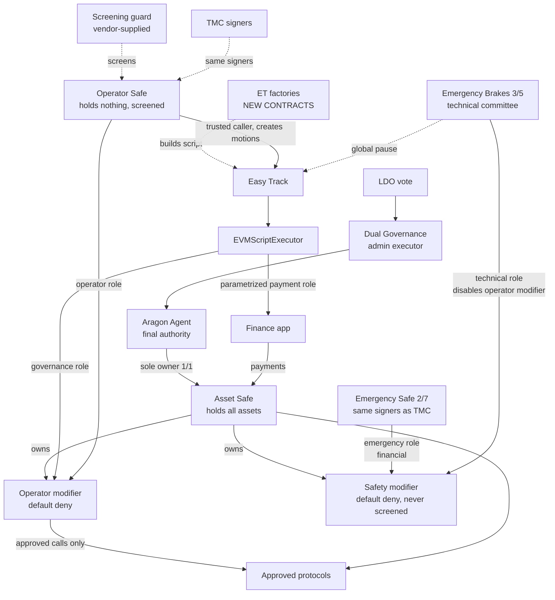

# LIP-XX: Active Treasury Management Vault

| LIP field | Value |
|---|---|
| lip | to be assigned |
| title | Active Treasury Management Vault |
| status | WIP |
| author | to be filled by proposers |
| discussions-to | a thread on https://research.lido.fi/, to be created |
| created | 2026-09-22 |

> **Where this draft stands.** It was written during the design review of 2026-09-10 to 2026-09-22 and moved into this repository on 2026-09-30. The [ADRs](/adr/index.md) record the decisions, and this draft must never contradict them [s2]. The chain facts that the ADRs rely on were re-read at block 26092572 [s3]. Any other chain fact in this draft is a claim from the design review that was not re-run. EM chose the screening route on 2026-10-02, and section 9.1 records it. EM chose the funding period and limit the same day, and section 5.2 records them. Open items are in the [open-decisions register](/registers/open-decisions.md).

> **Draft status.** Sections marked **[Implemented]** are built and covered by tests against deployed mainnet bytecode on a pinned fork. Sections marked **[Specified]** are designed but not built. Sections marked **[Open]** need a decision before this proposal can be finalised. No component has been deployed to mainnet. No audit has been performed.

## Simple Summary

Give the Treasury Management Committee a way to put a bounded slice of the DAO treasury to work in approved DeFi protocols, without ever letting it, or any service provider, take the assets. The DAO keeps ownership. An on-chain permission layer decides what the committee may do. An emergency Safe, held by the committee's own signers at a lower quorum, can pull everything back. The Emergency Brakes multisig can switch the operator off. Easy Track motions onboard protocols and switch strategies on and off, inside templates fixed at audit time.

## Abstract

We propose to deploy a Safe controlled solely by the Aragon Agent, and to attach two Zodiac Roles modifiers to it that enforce default-deny permissions. The **operator modifier** carries an **operator** role held by the Treasury Management Committee multisig and a **governance** role held by the Easy Track script executor. The **safety modifier** carries an **emergency** role held by a new Safe with a threshold of two and the same signer set as that committee, and a **technical** role held by the Emergency Brakes multisig.

All swapping, routine and emergency, runs through the DAO's existing treasury swap contracts, which price orders from an on-chain oracle and settle to a receiver fixed at deployment. Easy Track motions onboard new protocols and assets, switch approved strategies on and off, and adjust budgets within ceilings. Motions never submit a permission tree. Each factory generates the tree itself from a fixed template, so the shape of every permission is decided at audit time and only its parameters arrive by motion.

The only new contracts are Easy Track EVM script factories. No bespoke access-control, vault, or accounting contract is introduced. Funding reuses the existing Finance application and allowed-recipients machinery already in production.

## Motivation

### Background

The DAO treasury holds idle assets. A [Treasury Management Committee](https://docs.lido.fi/multisigs/committees#25-treasury-management-committee) exists and, by the principles under which it was formed, never takes custody. Putting treasury assets to work therefore requires a system where the committee can transact but cannot possess, and where the DAO can reverse any of it.

### Problem

Three properties are needed at once and no existing Lido component provides them together.

1. **Custody must stay with the DAO.** The Aragon Agent must remain the only owner of the assets, and no provider outage, suspension, or contract termination may change that.
2. **Authority must be bounded before execution, not after.** A report-and-remediate control does not stop a transaction. The system must deny unapproved targets, functions, and parameters at execution time.
3. **Routine changes must not require a full DAO vote, and must still not be arbitrary.** Adding an approved strategy should be an Easy Track motion with an objection window. That motion must not be able to widen authority beyond what the DAO already approved.

A conventional multisig fails the second property. A provider-operated vault fails the first. Granting Easy Track general execution authority over the Agent fails the third, because it would let a motion forward any script as the Agent and would put the entire treasury behind a three-day objection window.

### Solution

Separate **custody**, **authority**, and **change control** into three layers that are already audited, and add only the thin glue that Easy Track's interface requires.

- Custody: a Safe owned one-of-one by the Aragon Agent.
- Authority: two Zodiac Roles modifiers enabled as modules on that Safe, with the Safe as their owner.
- Change control: Easy Track motions through purpose-built script factories, which build every permission from a template fixed at audit time.

## Specification

### Overview



Every role executes **as the Safe**. The modifier checks the call against that role's permissions, then calls `execTransactionFromModule` on the Safe. Because the Safe owns the modifier, a role can also be permitted to administer the modifier itself, which is how the emergency and governance roles work without anyone holding authority over the Agent.

### Rationale

**Why the Safe owns the modifier, rather than the Agent.** A role's call executes with the avatar's authority. If the avatar owns the modifier, a narrowly scoped role can perform administrative calls on the modifier without the Agent being involved. This is what lets the emergency committee revoke the operator in minutes, and what lets Easy Track change policy without ever holding Agent authority. It is a deviation from the naive layout where the Agent owns the modifier directly, and it is load-bearing.

**Why Easy Track never gets Agent authority.** At block 26092572 the Easy Track script executor holds neither `RUN_SCRIPT_ROLE` nor `EXECUTE_ROLE` on the Agent. Only the Dual Governance admin executor holds them [s3]. Granting the executor either role would make every Easy Track motion capable of forwarding arbitrary scripts as the Agent, which contradicts the requirement that Easy Track have no unrestricted execution authority. The governance role on the modifier gives exactly the needed power and nothing else.

**Why template factories instead of motion-authored permissions.** A permission in the modifier is a condition tree stored per role, target, and selector, and a write replaces that slot entirely rather than merging into it. If motions could submit trees, every motion would have to be checked on-chain for being strictly narrower than what it replaces, which is a tree-comparison problem nobody should solve under an objection window.

Template factories remove the problem without forcing a vote for every new protocol. A factory accepts a small, typed parameter set — a target address, an asset, a budget key — and builds the condition tree itself from a shape fixed in its own code. The operator can therefore onboard a protocol through an ordinary motion, and still cannot express a permission the template does not describe. What an audit reviews is the finite set of templates, not an open-ended space of trees.

**Why the emergency role is easier to reach than the operator role.** The emergency role can only reduce exposure: revoke, exit, and return assets to the Agent. Its powers point one way. A lower quorum on a one-way power shortens response time without widening what can be done with it.

**Why no bespoke controller.** An earlier design used a purpose-built controller contract to hold an allowlist, a stale-motion counter, and budget ceilings. Each of those jobs turned out to be available without new code. Easy Track re-invokes the factory at enactment and requires the regenerated script to hash-match, so the factory's own allowlist doubles as the stale-motion rule. Budget ceilings and a refill-rate floor are expressible as native conditions. Escalation guards belong in the modifier. The controller was removed.

**Why every swap goes through the treasury swap contracts.** A pre-signed exchange order is opaque to the permission layer: the sell token, buy token, amounts and receiver are committed inside a hash the modifier cannot read, so neither price nor destination can be constrained there, and the only bound left is a standing approval. Routing every swap through the DAO's existing treasury swap contracts moves both guarantees into audited code already in production. The minimum output is computed on-chain from an oracle rather than supplied by the caller, and the settlement receiver is fixed in the instance at deployment rather than chosen per order. The permission the vault needs then shrinks to a transfer with the recipient pinned, and no role needs a standing approval to an exchange relayer at all.

**Why approvals are capped rather than unlimited.** An approval snapshot is not a loss bound if the operator can restore it. Capping the amount a role may approve makes the standing exposure bounded by construction.

### Technical Specification

---

#### Part 1: Account graph **[Implemented]**

| Component | Address | Source |
| --- | --- | --- |
| Aragon Agent | `0x3e40D73EB977Dc6a537aF587D48316feE66E9C8c` | existing |
| Aragon ACL | `0x9895F0F17cc1d1891b6f18ee0b483B6f221b37Bb` | existing, resolved via `Agent.kernel().acl()` |
| Dual Governance admin executor | `0x23E0B465633FF5178808F4A75186E2F2F9537021` | existing |
| Finance application | `0xB9E5CBB9CA5b0d659238807E84D0176930753d86` | existing, `vault()` returns the Agent |
| Easy Track | `0xF0211b7660680B49De1A7E9f25C65660F0a13Fea` | existing |
| EVMScriptExecutor | `0xFE5986E06210aC1eCC1aDCafc0cc7f8D63B3F977` | existing |
| TMC multisig | `0xa02FC823cCE0D016bD7e17ac684c9abAb2d6D647` | existing, threshold 4 of 7; its signers also sign the Operator Safe and the Emergency Safe |
| Emergency Brakes multisig | `0x73b047fe6337183A454c5217241D780a932777bD` | existing, threshold 3 of 5; holds the **technical** role and the global Easy Track pause |
| **Emergency Safe** | to be deployed | new Safe instance, **threshold 2**, owner set identical to the TMC multisig |
| Safe singleton v1.5.0 | `0xFf51A5898e281Db6DfC7855790607438dF2ca44b` | reused. `VERSION()` returns `1.5.0`, and the runtime codehash equals `0xdda019cbd7c867a533a2a86e5c53434fdc50b13122b5a5ddb4a8df61b31c20f2`, matching the published deployment record. Released 2025-07-03, audited by Certora and Ackee at pinned commits, covered by the Safe bug-bounty programme. Both new Safes use v1.5.0, by EM's decision of 2026-10-02 [s1]. The screening vendor's guard passed the same fork suite on v1.3.0, v1.4.1 and v1.5.0 [s6]. None of the six Lido Safes checked runs v1.5.0 today |
| Safe proxy factory v1.5.0 | `0x14F2982D601c9458F93bd70B218933A6f8165e7b` | reused |
| Zodiac Roles mastercopy | `0xF2964CE6161ce0e75964Fe7927cE114cb0B283D5` | reused, `owner()` is `0x…01`, i.e. locked |
| Zodiac ModuleProxyFactory | `0x000000000000aDdB49795b0f9bA5BC298cDda236` | reused |
| **Asset Safe** | to be deployed | new instance of the singleton. No guard is set on it |
| **Operator Safe** | to be deployed | new Safe instance with the TMC signers. Holds no assets and no modules. Threshold 4 of 7. Holds the operator role, is the trusted caller of every factory, and carries the screening guard |
| **Operator modifier** | to be deployed | minimal proxy of the mastercopy. Carries the operator and governance roles. The operator role is held by the Operator Safe, whose transactions are screened |
| **Safety modifier** | to be deployed | minimal proxy of the mastercopy. Carries the emergency and technical roles. Never screened |
| **Screening guard** | vendor-supplied | the screening vendor's existing transaction guard, one instance for the Operator Safe, set with `setGuard`. Not written by Lido |

The Emergency Safe and the Operator Safe are new instances of the audited Safe singleton, not new contract code. Their owner sets must be kept in step with the TMC multisig: a signer rotation on one is a rotation owed on all three, and that reconciliation is an operational duty with no on-chain enforcement.

**Deployment constraints.**

1. The Roles mastercopy keeps its own storage from slot 0. Deploying it behind a Safe proxy overwrites the proxy's implementation pointer with the avatar address and bricks the instance. It **must** be deployed through the Zodiac `ModuleProxyFactory`, which produces EIP-1167 minimal proxies that hold the implementation in bytecode.
2. The deployed mastercopy predates the current upstream source. Its initialiser is `setUp(bytes)` taking `abi.encode(owner, avatar, target)`, not the three-argument form. Audits and deployment tooling must pin the deployed bytecode, not repository HEAD.
3. `owner`, `avatar`, and `target` are all set to the Asset Safe.

#### Part 2: Roles and authority **[Implemented]**

Four principals. Role keys are `bytes32`; the encoding must match the tooling that applies the policy and is a deployment-time check.

| Role | Holder | May do | May not do |
| --- | --- | --- | --- |
| DAO | Aragon Agent, reached by vote through Dual Governance | Everything: owns the Safe, may replace the whole policy, may add or remove role members | — |
| `operator` | Operator Safe, the TMC signers, screened | Open, adjust, and close positions in approved protocols within budgets; approve approved spenders up to a cap | Transfer any asset out; borrow; create debt; administer the modifier or the Safe; change its own permissions |
| `emergency` | Emergency Safe, two of seven, same signers as the operator. **Safety modifier** | Set approvals to zero; exit positions to the Safe; swap to stablecoins through the recovery-family instances; transfer recovered assets to the Agent only; revoke the operator's targets and functions; invalidate outstanding orders | Add any permission; enter any protocol; borrow; change the recovery destination; disable the module |
| `technical` | Emergency Brakes multisig, three of five. **Safety modifier** | Disable the **operator** modifier, with the module argument pinned to it | Anything else. It cannot touch assets or permissions, and it cannot disable the safety modifier |
| `governance` | EVMScriptExecutor, driven by Easy Track | Toggle the operator's membership of pre-scoped role keys; set operator budgets within ceilings | Author a permission; name a target; grant a role to any other address; touch the emergency role; administer the Safe |

The emergency role's ability to revoke the operator works because the Safe owns the modifier: a call through the emergency role executes as the Safe, which the modifier accepts as its owner.

**Two classes of risk, and who answers each.**

*Financial risk* is the common case: a depeg, a dependency failure, a curator acting against the vault's interest, a position that must be unwound now. These need someone who watches the portfolio daily, understands the positions, and can act in minutes. That is the treasury committee, and the emergency role is a low-quorum subset of exactly those people. Its powers match the job: revoke, exit, swap to stablecoins, return to the Agent.

*Technical risk* is rarer and different in kind: a defect in the permission layer itself, or a report arriving through the bug-bounty programme. Two mechanisms cover it. The global Easy Track pause, held by the Emergency Brakes multisig, stops any pending governance change from enacting. Module disabling, held by the technical role, switches the operator modifier off. The safety modifier keeps working, so recovery survives.

Both technical remedies are therefore held by the same technical committee. It already holds the global Easy Track pause, it already contains engineering members, and technical risk already reaches it through the engineering organisation's existing channels including the bug-bounty programme. No new committee is created; an existing one receives one additional, single-function role.

This separation matters because the two remedies answer different failures. Pausing Easy Track stops a pending governance change from enacting. It does not stop an operator transaction and it does not stop a defect in the permission layer from being exercised. Only module disabling does that. Putting both in the hands of the people who recognise a technical defect removes the paging dependency that would otherwise sit on the critical path.

**Composition note.** The emergency role is deliberately drawn from the same people as the operator, at a lower quorum. This buys response time and removes the coordination cost of a separate body. It also means the two roles do not fail independently: a compromise of two operator signers is a compromise of the emergency role, and the guarantee that the operator cannot veto an emergency action now rests on role scoping alone rather than on separation of persons. The Easy Track pause role stays with the Emergency Brakes multisig, which is a different body, so freezing queued motions during an incident requires paging them.

#### Part 3: Permission encoding **[Implemented]**

Permissions are condition trees stored per `(roleKey, target, selector)`. Enum values below are from the deployed mastercopy and are normative for tooling.

`ParameterType`: `None=0`, `Static=1`, `Dynamic=2`, `Tuple=3`, `Array=4`, `Calldata=5`, `AbiEncoded=6`.

`Operator`: `Pass=0`, `And=1`, `Or=2`, `Nor=3`, `Matches=5`, `ArraySome=6`, `ArrayEvery=7`, `ArraySubset=8`, `EqualToAvatar=15`, `EqualTo=16`, `GreaterThan=17`, `LessThan=18`, `Bitmask=21`, `Custom=22`, `WithinAllowance=28`, `EtherWithinAllowance=29`, `CallWithinAllowance=30`.

Rules that constrain how policy must be written:

- **A write replaces a slot.** A second `scopeFunction` on the same role, target, and selector discards the previous tree. Policy must therefore be emitted as complete trees, and any tooling that appends permissions per-token must merge them before writing.
- **`Matches` requires exactly as many children as the call has parameters** at the level being matched. Trailing parameters that need no constraint take `Pass`.
- **Alternative calldata shapes use `Or` at the root** over full `Matches` branches. This is how per-asset budgets are expressed: one branch per asset group, each with its own `EqualTo` on the asset and its own `WithinAllowance` on the amount. Budget keys are independent across branches.
- **A budget key counts token units**, so a key shared across assets of different decimals is a defect. Each decimal class needs its own key.
- **Array elements are constrained with `ArrayEvery`** over a single child condition.
- **`Custom=22` invokes an external adapter by `staticcall`.** The adapter address is the leading 20 bytes of the 32-byte comparison value; 12 bytes of caller-defined data follow. Because it is a static call the adapter can read state but cannot write, cannot maintain a ledger, and cannot consume an allowance. No adapter is used in this proposal.

#### Part 4: Governance — the new contracts **[Implemented in part]**

The **only** new contracts are Easy Track EVM script factories. Each is small, holds no assets, and carries no authority of its own: it builds a script, and the modifier decides whether the resulting call is permitted.

##### 4.1 `RoleToggleEVMScriptFactory` **[Implemented]**

Switches the operator's membership of a role key the DAO has already scoped.

```solidity
interface IRoleToggleEVMScriptFactory {
    /// @notice The modifier being administered. Immutable: a motion can never
    ///         redirect administration to another contract.
    function roles() external view returns (address);

    /// @notice The only address a toggle may ever be applied to.
    function operatorSafe() external view returns (address);

    /// @notice The role key the emitted script executes under.
    function policyAdminRoleKey() external view returns (bytes32);

    /// @notice The only address permitted to create motions with this factory.
    function trustedCaller() external view returns (address);

    /// @notice The DAO, reached by vote. Sets which keys are togglable.
    function owner() external view returns (address);

    /// @notice Role keys the DAO has pre-scoped and permits toggling.
    function allowedRoleKey(bytes32 roleKey) external view returns (bool);

    /// @notice DAO vote pre-approves or withdraws a role key.
    /// @dev Withdrawing also kills any motion already in its objection window
    ///      for that key, because enactment rebuilds the script through here.
    function setRoleKeyAllowed(bytes32 roleKey, bool allowed) external;

    /// @notice Builds the CallsScript for one toggle.
    /// @param _creator Motion creator, checked against trustedCaller.
    /// @param _evmScriptCallData abi.encode(bytes32 roleKey, bool enable)
    function createEVMScript(address _creator, bytes memory _evmScriptCallData)
        external view returns (bytes memory);

    event RoleKeyAllowed(bytes32 indexed roleKey, bool allowed);

    error CallerIsForbidden(address caller);
    error NotOwner();
    error RoleKeyNotAllowed(bytes32 roleKey);
    error ZeroAddress();
}
```

The emitted script is a single CallsScript entry targeting the modifier:

```
0x00000001 ‖ bytes20(roles) ‖ uint32(len) ‖ roles.execTransactionWithRole(
    roles, 0, assignRoles(operatorSafe, [roleKey], [enable]), Call, policyAdminRoleKey, true)
```

The wire format is `[specId(4)][to(20)][calldataLength(uint32)][calldata]`, where the length covers the selector and the arguments. This matches `EVMScriptCreator` in the Easy Track source. A 32-byte length field is **not** the production format and must be rejected.

##### 4.2 Defence in depth in the modifier **[Implemented]**

The governance role is separately constrained so that a factory bug cannot widen anything.

- `assignRoles` is scoped with the member pinned by `EqualTo` to the operator multisig, the role-key array constrained by `ArrayEvery` over an `Or` of approved keys, and the boolean array left open.
- Every other administrative selector granted to the governance role pins the role key to `operator` by `EqualTo`, and refuses the modifier and the Safe as the administered target using `Nor(EqualTo(roles), EqualTo(safe))`.
- `assignRoles` and `setDefaultRole` as general membership setters are **not** granted. Membership changes beyond the pre-approved key set are a DAO vote.

The target refusal is necessary because pinning the role key alone is insufficient: without it, a motion could grant the operator a permission whose target is the modifier, and the operator would then reach owner-only administration through the avatar.

##### 4.3 Template factories for onboarding **[Specified]**

Not yet built. These let Easy Track onboard a protocol or asset without a DAO vote and without submitting a condition tree. Each factory owns one template. Motion call data carries only typed parameters; the factory constructs the tree.

The catalogue below is the set that EM accepted on 2026-09-22 [s1].

| Factory | Motion parameters | Emits |
| --- | --- | --- |
| `AddWrapFactory` | wrapper, underlying | `wrap` and `unwrap`, or `deposit` and `withdraw` on WETH; the output returns to the avatar |
| `AddERC4626VaultFactory` | vault, asset, budget key | `deposit` with amount under `WithinAllowance` and receiver `EqualToAvatar`; `redeem` and `withdraw` with receiver and owner `EqualToAvatar` |
| `AddQueueVaultFactory` | vault, asset, budget key | the asynchronous deposit request with the amount under `WithinAllowance` and the owner pinned to the avatar; the redeem request, cancel and claim with receiver and owner pinned to the avatar |
| `AddSpenderApprovalFactory` | token, spender, cap | `approve` scoped to that spender, amount either zero or `LessThan` cap |
| `AddSwapInstanceFactory` | swap instance | `transfer` scoped with the recipient pinned to that instance, for the rebalancing family only |
| `AddMorphoBlueMarketFactory` | market parameters, budget key | `supply` with `onBehalf` pinned to the avatar and the amount under `WithinAllowance`; `withdraw` with `onBehalf` and `receiver` pinned to the avatar. **Ships at launch even though no market address exists yet.** Acceptance requires end-to-end tests against the deployed Morpho Blue contract on a fork, so the template is proven before the market it will be pointed at exists |
| `RemoveTargetFactory` | target | `revokeTarget` for the operator role |
| `RemoveFunctionFactory` | target, selector | `revokeFunction` for the operator role |

A lending-pool template for markets such as Aave is not in the catalogue, because third-party lending markets are outside the launch scope.

The trusted caller on every factory is the **operator multisig**, matching the pattern already used by the treasury swap factories. Every factory hard-codes the role key to `operator` and refuses the modifier and the Safe as a target.

**Disclosure required with an onboarding motion.** A forum post published before the motion, covering the target, the template applied, the initial budget, and the diligence performed; monitoring and alerting configured for the new target before enactment; and the incident runbook updated. The stop mechanisms are the objection threshold and, failing that, the global Easy Track pause held by the Emergency Brakes multisig. Removal factories carry no allowlist, because revocation is always narrowing and must never be blocked.

**On shortening the window for removals.** Easy Track stores a motion's duration, but assigns it from a single global setting at creation. There is no per-factory duration. A removal motion therefore carries the same objection window as every other motion, and a zero-delay removal cannot be expressed by writing a different factory.

This does not leave a gap, because the zero-delay path already exists and is held by the right body. The emergency role holds `revokeTarget` and `revokeFunction` pinned to the operator, and acts immediately with two signatures. Immediate de-scoping is an emergency action; Easy Track removal is the routine, reviewable one. EM asked on 2026-09-22 that removal templates skip the objection window [s1]. The only routes to a zero-delay Easy Track removal are changing the global duration, which affects every Lido motion, or deploying a second Easy Track instance, which fragments governance. Neither is recommended. Open item OD-09 holds the choice.

Invariants an audit must confirm for each template: no receiver, owner, or beneficiary field is ever left open; every value-moving amount is either budgeted or capped; no template can emit an administrative selector; and the emitted script parses under the production script format.

Residual risk to state in the mandate: a motion can point the operator at a contract nobody has audited. The template bounds *how* the vault interacts with it — receivers pinned, amounts budgeted — so the loss ceiling is the attached budget, not the balance. The controls are the objection window, the diligence published with the motion, and monitoring. This is what optimistic governance means here, and it should be said plainly rather than implied.

##### 4.4 `BudgetEVMScriptFactory` **[Specified]**

Not yet built. Adjusts an operator budget. The modifier already constrains `setAllowance` natively:

- the allowance key must be one of the operator's budget keys, by `Or` of `EqualTo`;
- `balance`, `maxRefill`, and `refill` are each bounded by `LessThan` a per-key ceiling;
- `period` is bounded below by `GreaterThan` a floor, which prevents a motion from turning a monthly budget into a per-second one.

#### Part 5: Funding **[Specified]**

Funding reuses production machinery. No new contract class beyond a factory.

The Easy Track script executor already holds `CREATE_PAYMENTS_ROLE` on the Finance application with 22 Aragon ACL parameters attached. Those parameters form a conditional chain binding argument 0 (token) and argument 2 (amount). Argument 1 is the **receiver and is not constrained at the ACL layer**; recipient control lives one layer above, in the registry and factory.

Per-payment ceilings recorded in the ACL parameter tree, re-read at block 26092572 [s3]:

| Token | Ceiling per payment |
| --- | --- |
| stETH | 1,000 |
| ETH | 1,000 |
| DAI | 2,000,000 |
| USDC | 2,000,000 |
| USDT | 2,000,000 |
| sUSDS | 2,000,000 |
| LDO | 5,000,000 |

Many allowed-recipient setups already run on mainnet, each combining an `AllowedRecipientsRegistry` with period limits, optionally an `AllowedTokensRegistry`, add and remove factories, and a `TopUpAllowedRecipients` factory. Twelve top-up registries are live, and the committee's existing Safe is the trusted caller of two of them [s7].

**Setup, decided by EM on 2026-10-02 (OD-06):** two dedicated registries, one for stablecoins and one for stETH. The Asset Safe is the only recipient of each, and the Easy Track executor cannot add recipients. Each registry has a period of one calendar month and a limit of one TM Floor Value per period. Two `TopUpAllowedRecipients` factories, the stablecoin one with its own token list (OD-11), take the operator Safe as trusted caller and are registered by DAO vote [s7]. Section 5.2 gives the reasons and the gaps.

##### 5.1 Scaling the existing caps to the mandate size **[Investigated]**

Findings, first read at block 26017715 and re-read at block 26092572 [s3].

- **The ACL ceilings are per call, not per motion or per period.** Each `newImmediatePayment` is authorised separately. A single motion whose script contains several payment calls is therefore bounded by the number of calls, not by the ceiling.
- **The Finance application adds no second cap.** Token budgets are disabled: `getBudget` returns amount 0 with the budgeted flag false for USDC, DAI, and stETH. The 30-day period exists but binds nothing.
- **The grant is shared.** The parametrized `CREATE_PAYMENTS_ROLE` is held by the single Easy Track script executor, which every Lido top-up factory routes through. Raising a ceiling raises it for every allowed-recipient setup at once.
- **The permission manager is Aragon Voting** at `0x2e59A20f205bB85a89C53f1936454680651E618e`, so any parameter change is an Aragon vote, and the whole 22-entry parameter array is rewritten as one unit.

**Recommendation: do not change the ACL parameters.** EM has not accepted this yet (open item OD-11). Seed and top up through several payments inside one motion, and let the real ceiling be the period limits on the two dedicated registries, which are ours alone (section 5.2). The number of payments follows from the limits and the ceilings, and an attested computation must produce it. This keeps the blast radius of the change inside our own registry instead of widening a shared grant.

Two consequences to accept. A per-payment ceiling is not a per-motion ceiling, so the registry period limit is the backstop that matters, and section 5.2 sizes it. And **USDS is absent from the ACL token chain**, so it cannot be paid out on this route at all; seeding in USDS would require rewriting the shared parameter array by vote, which the recommendation above avoids. Seed in USDC, USDT, DAI or stETH. The Agent holds less than 8 ETH, so ETH needs no top-up path (OD-11) [s7].

##### 5.2 Period and limit **[Decided, OD-06]**

The mandate puts seeding and top-ups on Easy Track, and it makes the objection the control of a top-up. The registry is the backstop.

- **Period: one calendar month.** The mandate's top-up follows each month-end snapshot, so each month's top-up has its own limit. No live Lido registry uses one month; they use three, six or twelve [s7].
- **Limit: one TM Floor Value per registry per month.** Stablecoins count at par. The stETH limit is the floor at the Coingecko price pinned when the enabling vote is prepared, set by attested computation. Either asset can carry a full refill, as the mandate allows for the seed and for the runway protection's stETH top-up.
- **Why two registries.** A registry counts token units after scaling decimals, so 1 stETH counts as 1 USDC. One limit cannot hold both assets to a dollar figure [s7].
- **Gap 1: more than one floor a month.** Without an objection, the operator Safe can pull one floor per registry each month. Around a month boundary, one registry can pay two full limits within about 72 hours, because a motion that can only be enacted in the next period is checked against that period's full limit [s7]. The mandate's limit on the vault's size is therefore a procedure, not code.
- **Gap 2: the stETH limit is fixed in tokens.** The mandate values stETH at the Coingecko price at each motion. After an ETH fall, a refill in stETH alone reaches less than the floor in one month; the rest follows the next month or in stablecoins. After an ETH rise, the stETH limit is worth more than a floor. The DAO re-pins the limit by vote when needed.
- **Compensating controls.** The operator Safe creates every top-up motion, so each one passes the screening guard and the 72-hour objection window. Monitoring flags a top-up motion outside days 1 to 10 of a month, apart from the seed; a month's top-ups above the shortfall posted on the forum; and any top-up motion after an objected one. The screening policy carries a dollar rule per motion, if the vendor supports it (OD-07).
- **What the registry cannot enforce.** The mandate's rule that, after an objection, a further pull needs a Snapshot vote. A DAO vote can set the limit to zero.
- **Not chosen.** A three-month period; a stETH limit at a stress price; one floor split between the registries; and one registry with one dollar limit, through a token registry that counts stETH at a DAO-pinned rate, which needs a new contract. That registry could not use a live rate: Easy Track rebuilds the script at enactment and checks its hash, so a rate that moves during the objection window blocks the motion [s7].

#### Part 6: Emergency response **[Implemented]**

All permissions in this part are written into the **safety modifier**. Its holders never pass through the screening guard.

The emergency role holds, and nothing else:

- `approve(spender, 0)` on each launch token, spender drawn from the approved-spender list;
- exits: pool withdraw with the receiver pinned to the avatar, savings-vault redeem and withdraw with receiver and owner pinned to the avatar, asynchronous vault cancel, claim, and redeem;
- `unwrap` on the wrapped staking token;
- `transfer(to, amount)` with `to` pinned by `EqualTo` to the Agent literal, on every asset and receipt token the Safe can hold;
- `revokeTarget(operator, …)` and `revokeFunction(operator, …)` on the modifier, role key pinned to the operator;
- `invalidateOrder(bytes)` on the order settlement contract;
- `transfer(to, amount)` with `to` pinned by `EqualTo` to an approved recovery-family swap instance (see 6.1);
Module disabling is **not** in this role. It belongs to the technical role; see 6.2.

Separately and already deployed: the Emergency Brakes multisig holds the pause role on Easy Track and does not hold unpause. Pausing Easy Track during an incident freezes every queued motion, and only the DAO can resume. This is the durable answer to a queued expansion re-enabling something the emergency role just revoked, and it must be a step in the incident runbook.

##### 6.1 Swapping — the default engine for both roles **[Specified]**

Neither role receives a direct exchange permission. Every swap, routine or emergency, goes through the DAO's treasury swap contracts.

The path is two steps and only the first needs a permission:

1. The role calls `transfer` on the asset, with the recipient pinned by `EqualTo` to an approved swap instance.
2. The instance's manager calls `placeOrder`. The operator Safe manages the rebalancing instances and the emergency Safe the recovery instances (OD-05). The order's minimum output is the oracle quote less the instance's margin; the manager can raise it, never lower it. Its settlement receiver is fixed in the instance.

**The receiver is what separates the two roles.** It is an immutable set at deployment, so the destination of proceeds is structural rather than chosen per order. Two families of instances are deployed:

| Family | Used by | `RECEIVER` | Effect |
| --- | --- | --- | --- |
| Rebalancing | `operator` | Asset Safe | Proceeds return to the vault, so the operator can trade but cannot move value out |
| Recovery | `emergency` | Aragon Agent | Proceeds go to the DAO treasury, matching the mandate's fixed recovery destination |

The operator therefore cannot route proceeds anywhere but the vault, and the emergency role cannot route them anywhere but the Agent, without either constraint being expressed as a condition.

Properties confirmed on the deployed instances: `RECEIVER()` is a per-instance immutable and the two live instances differ, one settling to the Agent and one to another contract; `estimateTradeOutput` returns a live oracle quote; `ORDER_DURATION_IN_SECONDS`, `MARGIN_IN_BASIS_POINTS` and `PRICE_TOLERANCE_IN_BASIS_POINTS` are per-instance immutables, currently 1800, 110 and 550 on the live instances; and `recoverERC20`, `recoverEther` and `recoverERC721` exist, so assets are not stranded when an order does not fill. Only an instance's admin or manager can place an order or recover tokens, and recovered tokens always go to the instance's fixed recovery address. Every instance from the standard factory has Aragon Voting as admin and the Aragon Agent as recovery address. The Stonks 2.0 instances also fix a maximum improvement and allow partial fills.

What this removes from the design: the operator needs no order pre-signing permission, and no role needs a standing approval to an exchange relayer. The unbounded-approval exposure and the opaque-order problem both disappear for swapping.

What it costs, and what must be planned:

- **An instance is one `(tokenFrom, tokenTo, receiver)` triple, fixed at deployment.** Every instance in this system is deployed fresh from the existing factory. None of the nine existing treasury instances is reused: they are the earlier revision with the receiver hardcoded, and their manager is the operator committee.

##### 6.1.1 Instance matrix **[Open — topology]**

Sellable assets are stETH, wstETH, WETH, LDO and the four dollar stablecoins. The savings and queue vault positions are redeemed through their own contracts, not swapped, so they need no instance.

| Family | Receiver | Scope decided so far |
| --- | --- | --- |
| Recovery | Aragon Agent | Any sellable asset into a dollar stablecoin, **including stablecoin to stablecoin** |
| Rebalancing | Asset Safe | Among stETH, wstETH, USDC, USDT, USDS and LDO |

The topology is the remaining decision, and it changes the deployment surface by roughly a factor of three.

- **Full mesh.** Recovery covers four volatile assets into four stablecoins, plus each stablecoin into the other three: 28 instances. Rebalancing covers every ordered pair of the six named assets, less the stETH and wstETH pair which is a wrap rather than a swap: 28 instances. About 56 in total.
- **Hub.** One canonical stablecoin is the hub. Recovery sells everything into it, and a small number of stablecoin pairs cover the rest. Rebalancing routes through the hub in both directions. Roughly 17 in total.

**Decision: hub, with a second recovery destination.** USDC is the hub. Rebalancing routes through it, so every rebalancing pair is one hop and the rare non-hub route costs two. Recovery sells every asset directly into the hub, so nothing needs two hops under stress.

Recovery additionally carries USDT as a **second destination for the volatile assets**. A single hub has one failure mode that matters here: if the asset being fled is the hub itself, recovery into it is exactly wrong, and a hub depeg would strand the recovery path. The second destination removes that dependency for the assets most likely to need a fast exit.

That gives roughly eleven recovery instances and ten rebalancing instances, about twenty-one in total, against about fifty-six for a full mesh. Direct pairs can be added later by motion where a route proves costly in practice. Each instance is an address the transfer permission must pin, so an unused instance still costs deployment, configuration and monitoring surface.

Each instance's address is pinned in the transfer permission of the token it sells, so the set is fixed at policy-application time and grows only by a policy change.
- **Swaps are not instant.** Orders run for a bounded duration with an oracle-derived floor, so a rebalance is a queued action, not an immediate one. The emergency service level remains time-to-initiate.
- **Assets sit in the instance between transfer and settlement.** This is a short custody excursion out of the Asset Safe and should be stated plainly rather than glossed.
- **The committee Safes are the managers** (OD-05). The operator Safe manages the rebalancing instances, and its orders pass the screening guard. The emergency Safe manages the recovery instances. A manager cannot take tokens: recovery always pays the Aragon Agent. Tokens recovered from a rebalancing instance therefore leave the vault for the treasury, and a top-up motion brings them back if the mandate allows it.
- **Pricing must be configured before launch.** The deployed converter prices only stETH and LDO. The vault's pairs need a new converter instance and oracle-router feeds for wstETH, WETH, USDC, USDT, DAI and USDS (OD-20).
- **No existing instance is reused.** The deployed treasury instances are the earlier revision with the receiver hardcoded, and their manager is the operator committee. Both properties are wrong for this system, and sharing an instance would mix vault flows with ordinary DAO swaps in one balance.

##### 6.2 Module disabling — the technical role **[Implemented]**

One role, one function, held by the technical committee.

```
scopeTarget(technical, assetSafe)
scopeFunction(technical, assetSafe, disableModule(address,address), [
    root:        Calldata  Matches
    prevModule:  Static    Pass        // linked-list pointer, varies with the module set
    module:      Static    EqualTo(rolesModifier)
])
```

The module argument is pinned, so the power cannot be turned on a future second module. The predecessor pointer must stay open because its value depends on the Safe's module list at call time. This closes the long-standing objection to an unpinned disabling scope: the original proposal left both arguments open because its tooling could not place a not-yet-deployed address into a condition, and applying the policy after deployment removes that constraint.

Disabling switches off the operator and governance roles at once. The safety modifier stays enabled, so the emergency role can still revoke, exit and return assets. The owner path restores service by re-enabling the module. Because recovery survives the switch, the technical committee does not need to wait for the financial committee to finish, and no cross-committee sequencing rule is needed.

If the defect is in the safety modifier itself, the technical role cannot help: its pin is exact. Recovery then runs through a DAO vote acting as the Safe's owner, which carries the Dual Governance delay.

Tested: the emergency role and the operator are both refused; the technical role cannot point the call at another module address; it can disable the operator modifier; the operator then stops working while the safety modifier stays enabled and the emergency role still moves assets to the Agent; the technical role cannot disable the safety modifier; and the owner path restores the operator modifier [s4].

**Recovery semantics to state honestly.** Exiting a position and receiving the assets are different events. Where a protocol has no liquidity, the emergency role transfers the receipt token to the Agent, which moves custody without completing the exit. Where a vault settles asynchronously, the role can start the exit and claim later. The target is time-to-initiate, not time-to-receive.

#### Part 7: Budgets **[Implemented]**

Budgets are consumable allowances keyed by `bytes32`, drawn by `WithinAllowance` nodes in the operator's permissions. Semantics verified against the deployed mastercopy: consumption happens only on success, a reverted call consumes nothing, a key shared across branches draws across them, and refills accrue by elapsed periods capped at the maximum.

The `Allowance` struct field order in the deployed mastercopy is `refill, maxRefill, period, balance, timestamp`. Tooling that reads the getter must use this order; transposing balance and timestamp yields a Unix timestamp where a balance is expected.

#### Part 8: Launch asset and action matrix **[Open in part]**

| Asset | Role in the system | Notes |
| --- | --- | --- |
| ETH | Held, funding inbound | In the Aragon payment parameter chain, ceiling 1,000 per payment |
| WETH | Held, wrap and unwrap | |
| stETH | Held, funding inbound | In the payment chain, ceiling 1,000 per payment |
| wstETH | Held, wrap and unwrap | |
| USDC | Held, funding inbound | In the payment chain, ceiling 2,000,000 per payment |
| USDT | Held, funding inbound | In the payment chain, ceiling 2,000,000 per payment |
| DAI | Held, funding inbound | In the payment chain, ceiling 2,000,000 per payment. Added so the mandate's definition of the top four stablecoins matches the launch set |
| USDS | Held | **Not in the payment chain — cannot be used to seed the vault** |
| sUSDS | Held, savings position | Template: tokenized vault |
| earnETH | Held, vault position | Asynchronous deposit and redeem queues |
| earnUSD | Held, vault position | Asynchronous deposit and redeem queues |
| LDO | Held, in the rebalancing set | |
| Swap instances | Rebalancing and recovery venue | Both roles, through the treasury swap contracts. Price is oracle-bounded and the destination is fixed per instance; no direct exchange permission and no standing relayer approval exists |
| Lido Lend | Lending venue | Expected October 2026, Morpho-Blue-compatible. **Zero-day ready by design:** the Morpho-Blue template ships at launch with end-to-end tests against the live Morpho Blue deployment, so onboarding is one Easy Track motion carrying the market address once it exists. No vote, no new contract, no policy migration. The protocol cap applies for its first three months, then none as a Lido own product (OD-04) |

Assets explicitly **not** in the launch set: sDAI and third-party lending markets other than Lido Lend.

One constraint remains after adding DAI. USDS is in the launch set but absent from the Aragon payment parameter chain, so **seeding and top-ups use USDC, USDT, DAI, stETH or ETH**. Acquiring USDS happens inside the vault, not on the way in.

#### Part 9: Reporting and detective controls **[Specified]**

Exposure ratios are **detective** controls. The permission layer cannot see valuation, so the caps in the mandate are enforced by measurement, publication and remediation, not by reverting a transaction. This must be stated in the mandate in exactly those words.

Reporting is published so that a third party can check it later without trusting the publisher's own website.

- **Payload on IPFS.** The full report — balances, positions, per-asset and per-protocol exposure, the ratios with their numerator and denominator, the price source and its timestamp — is a document addressed by content hash.
- **Anchor on chain.** The content identifier is published so the report cannot be silently replaced.

On the anchor, one finding matters. The DAO's DataBus contract is **not deployed on Ethereum mainnet**. It exists at the same address on Gnosis Chain, Base, Optimism and Polygon PoS. Using it means the anchor lives on a sidechain with that chain's security assumptions, while the assets live on Ethereum. Its `sendMessage` is permissionless, so any consumer must filter by the indexed sender, and the event is anonymous, so an indexer must be configured for it deliberately.

**Decision: IPFS, and no sidechain.** The payload is content-addressed on IPFS. An earlier draft put a funding motion's report identifier in the Aragon payment's `reference` field. That does not work: the standard top-up factory writes a fixed reference, "Easy Track: top up recipient" [s7]. The identifier goes in the forum post that the mandate requires before each top-up. Where to anchor it on chain is open (OD-14).

DataBus is **not adopted**, at least for now. It is not deployed on Ethereum, so it would put the anchor on a sidechain while the assets sit on Ethereum, and that is a trust step this proposal does not need to take.

The honest consequence, which must be stated rather than glossed: no report has an **on-chain anchor** yet, a funding motion's report included. Its immutability rests on content addressing plus the forum post that cites the identifier. That is adequate for an informational control and it is not an Ethereum guarantee. If that is later judged insufficient, an anchor can be added without changing anything else in the design.

Whichever is chosen, the reporting key, the schedule, the behaviour on a stale or missing price, and who is accountable when a report is late must be named in the mandate.

##### 9.1 Detection, response, and the limits of blocking **[Open]**

**Detection** runs in two estates in parallel. The Lido on-chain monitoring suite carries the rules that are cheap to express over block data: policy drift against the intended permission set, approval inventory, budget burn rate, module and owner changes on both Safes, and motion lifecycle events. A commercial monitoring service carries the rules that need market and threat context: depegs, protocol compromise signals, and counterparty anomalies. Findings from both route into the existing notification and incident channels.

**Response to a ratio breach** is a financial judgement and belongs to the operator committee, working to the mandate's remediation window after the fortnightly review. If a breach worsens rather than resolves, the escalation is the technical role disabling the operator modifier, which stops all operator activity while recovery stays available.

**Blocking a transaction before it executes** is a hard requirement. EM chose the route on 2026-10-02 [s1]: a dedicated operator Safe with its own screening guard, which is also the trusted caller of every factory (ADR 010) [s2].

##### 9.1.1 The screening guard **[Decided — transaction guard on the Operator Safe]**

- The operator role is held by the Operator Safe, a new Safe with the TMC signers. It holds no assets and has no modules.
- The screening vendor's existing transaction guard is set on the Operator Safe with `setGuard`. It is the vendor's code, already deployed for other Lido multisigs and audited by an external firm. Lido writes nothing here [s6]. The vault uses the same build as those multisigs. That build adds one change after the audit, both timelocks raised from 1 day to 10 days, which Lido reviews (OD-07).
- The guard checks every transaction that the Operator Safe executes. The vendor's key must approve the exact transaction, once, before it executes. A transaction without an approval reverts, so the guard fails closed [s6].
- The Operator Safe is the trusted caller of every factory, so every motion is created through the guard. Motion enactment is not screened, but the hash check fixes a motion's content at creation.
- Recovery and the technical role never touch vendor code. The emergency Safe and the Emergency Brakes multisig act through the safety modifier, and no guard is set on the Asset Safe.
- The Operator Safe's owners can remove the guard only through a fixed 10-day timelock that the vendor cannot block. A vendor outage therefore stops operator activity for at most ten days, and a hostile removal stays visible for ten days [s6].
- The enabling vote grants the operator role only after the guard is set and its bypass mode is off. The owners cannot turn the bypass on again without the vendor's approval and a 10-day timelock (OD-07).
- The vendor agreement forbids standing approvals on this guard: approvals of one call at any nonce, or of one function with any arguments. Only the guard's two built-in timelock approvals stay (OD-07).
- The vendor confirms in writing that its approval service supports Safe v1.5.0. Without that confirmation, the Operator Safe uses v1.4.1, the version the guard runs on today (OD-07).

Lido's on-chain monitoring already has a detector for this guard. It alerts on the start of the removal or bypass timelock, the bypass mode turning on, any approval that is not bound to one transaction, any keeper change, any added policy contract, and any module, guard or owner change on the guarded Safe. It must add Safe v1.5.0 and the Operator Safe's instance. Every operator transaction calls the same modifier function, so one standing approval of that function would approve all vault activity.

##### 9.1.2 Why not a module guard on the Asset Safe **[Rejected]**

Safe v1.5.0 calls a module guard for every enabled module, the safety modifier included [s5]. Recovery would then pass only because the vendor's code let the safety modifier through, and only a DAO vote, with the Dual Governance delay, could remove a failed guard. A module guard also receives no signatures, so a per-transaction approval needs a separate step on chain. The screening vendor's existing guard is a transaction guard and cannot be set as a module guard [s6].

##### 9.1.3 Failure behaviour, authority and costs **[Decided]**

**Failure behaviour: fail closed.** A guard that cannot reach a verdict refuses the operator transaction. Recovery is unscreened by construction, so a stuck guard stops new risk being taken while still allowing exit. The trade is a frozen operator during a vendor outage, which is accepted.

**Flagging authority: the vendor, unilaterally.** No Lido co-signature is required to block, because adding one would trade away the response time the control exists to buy. The counterweights are that the Operator Safe's owners can remove the guard after its 10-day timelock, the DAO can give the operator role to another Safe, and the technical role can disable the operator modifier outright.

**The guard is vendor-supplied.** It is the one component in this design that can stop operator activity and motion creation, and Lido does not write it. That makes it a dependency with its own audit and its own liveness risk. Three mitigations are structural rather than contractual: recovery never passes through it, the owners can remove it after ten days, and the technical role can disable the operator modifier outright. This is a deliberate narrowing of the provider-independence property, and it should be stated in those terms rather than presented as cost-free.

**The split also removes a sequencing hazard that existed independently.** Previously, disabling the module removed every role at once, so the emergency role had to finish exiting before the technical role acted, and that ordering crossed committee boundaries with nothing enforcing it. Now the technical role disables the operator modifier while the safety modifier keeps working, so recovery survives the kill switch and the ordering constraint disappears.

**Governance is screened at creation.** The governance role sits on the operator modifier and is held by the Easy Track executor, which no guard covers. Because the Operator Safe is the trusted caller, every motion is created through the guard, so a hostile onboarding motion meets the screening at creation. A screening outage therefore delays new motions as well as operator activity. This is acceptable because motions already carry a three-day window.

**Modifier replacement is a documented procedure, not an automatic one.** The safety modifier pins the operator modifier's address in the emergency revoke permissions and in the technical disable permission. Replacing the operator modifier therefore invalidates those pins, and the safety policy must be rewritten by DAO vote in the same action. This is accepted and belongs in the runbook; it is the cost of pinning, and pinning is what makes the technical role safe.

Costs: a third Safe with the TMC signers, two policy applications, two sets of role keys, two modules enabled on the Asset Safe, a module argument pinned per instance, and the Operator Safe pinned as the immutable trusted caller of every factory.

### Test Cases

40 tests pass against deployed mainnet bytecode on a fork pinned at block 25946643, at commit 370e20a of this repository [s4]. Nothing has been deployed to mainnet. The [invariants](/specs/invariants.md) map these tests to the invariants they check.

| Group | n | Covers |
| --- | --- | --- |
| Governance script encoding | 6 | Production CallsScript format accepted; 32-byte length rejected; truncated length rejected; multi-call script; script substituted at enactment rejected; objection rejection |
| Governance change types | 4 | Asset, target, selector, parameter constraint |
| Direct DAO path | 1 | The owner path applies the same change without Easy Track |
| Factory-only governance | 3 | Toggle enacts and grants the pre-scoped role; DAO withdrawal of a key kills a queued motion; unapproved key and foreign creator rejected |
| Native constraints | 2 | Toggle restricted to pre-approved keys with the member pinned; allowance ceilings and refill-period floor |
| Escalation guards | 4 | Governance cannot change membership, cannot touch the emergency role, cannot grant the operator an administrative target, cannot raise a foreign allowance key |
| Operator lifecycle | 3 | Positions opened and closed on real protocol contracts; receiver pinning enforced; asynchronous vault deposit authorised at the policy layer |
| Emergency and module | 2 | Revoke, exit, and return-to-Agent flow; module disabling with owner recovery |
| Approvals and orders | 3 | Unlimited approval rejected; operator cannot restore an approval after revocation; outstanding order invalidated |
| Budgets | 3 | Consumption, exhaustion, refill; per-asset keys independent; 18-decimal assets draw their own key |
| Adversarial | 1 | Operator cannot widen, cannot reach administration, cannot act as another role |
| Known limits recorded as tests | 2 | Order pre-signature is opaque to the modifier; a single-child match leaves trailing parameters unconstrained |
| Policy shape and funding | 3 | Policy builds within bounds; approvals survive duplicate writes; funding bootstrap |
| Pre-execution screening | 3 | A flagged operator transaction is refused; recovery is never refused; the owner path removes a failed guard. These tests cover the rejected module-guard route and must be rewritten for the Operator Safe's guard |
| **Total** | **40** | |

Reproduce with `forge test` against an archive RPC, fork block 25946643.

## Configuration

### Parameters

| Parameter | Meaning | Proposed value |
| --- | --- | --- |
| Objection period | Easy Track window before a motion may enact | 72 hours, the Easy Track default |
| Objection threshold | Share of LDO supply that rejects a motion | 0.5 percent, the Easy Track default |
| Approval ceiling per token | Upper bound on an approval the operator may set | **[Open, OD-08]** One deposit, not one month of them. Swapping needs no approval at all now, so the only approvals are to protocol contracts and the budget already bounds the flow |
| Budget per key | Monthly token-unit allowance | **Derived, run and attested** on 2026-09-22 outside this repository. Monthly flow equals the stock cap for that key, because exits are unbudgeted and a tighter flow would throttle re-entry after a defensive exit. Yield-bearing keys get the headroom against the literal base, the stablecoins plus yield-bearing stablecoins held directly, from a holdings snapshot at each retune (OD-03). The inputs include unapproved mandate terms, so the computation and its result enter this repository when the mandate is approved |
| Lido own-product budgets | Monthly allowance for the vault products | The mandate sets no per-product cap and the whole vault may sit in Lido products, so these keys are bounded by the mandate size rather than by a ratio. That is a weak control. The budget exists to bound blast radius per month, not to enforce a ratio |
| Budget retune cadence | How often unit budgets are re-derived | Fortnightly, riding the existing rebalancing review. Budgets are token units and caps are ratios, so they drift with price |
| Budget refill period floor | Lower bound enforced on `period` | 30 days proposed |
| Swap order duration | Per-instance immutable on each swap instance | 1800 seconds, as on the live instances (OD-05) |
| Swap margin | Per-instance immutable, basis points | 110 for volatile pairs, 30 for stablecoin pairs (OD-05) |
| Swap price tolerance | Per-instance immutable, basis points | 550 for volatile pairs, 150 for stablecoin pairs (OD-05) |
| Swap maximum improvement and partial fills | Per-instance immutables | 1000 basis points; partial fills on (OD-05) |
| Funding period and limit | Funding cap per period, in each of the two registries | One calendar month; one TM Floor Value per period in each registry; stablecoins at par; stETH at the Coingecko price pinned when the enabling vote is prepared. Set by attested computation; the figures enter with the approved mandate (OD-06, decided) |

### Roles and Authority

| Action | Who | Path | Latency |
| --- | --- | --- | --- |
| Open or close a position | Operator Safe, with the vendor's approval | Through the operator modifier | After the approval lands |
| Toggle an onboarded strategy | Operator Safe proposes with the vendor's approval, anyone enacts | Easy Track motion, governance role | 72 hours |
| Adjust a budget within ceilings | Operator proposes | Easy Track motion, governance role | 72 hours |
| Onboard a new protocol or asset | Operator proposes | Easy Track motion, template factory | 72 hours |
| Top up the vault | Operator Safe proposes with the vendor's approval, anyone enacts | Easy Track motion, top-up factory, paying the Asset Safe only | 72 hours |
| Revoke the operator | Emergency Safe, two signatures | Direct through the modifier | Minutes |
| Disable the operator modifier | Emergency Brakes multisig, three signatures | Direct through the safety modifier, technical role | Minutes |
| Freeze queued motions | Emergency Brakes multisig, a separate body | Easy Track pause | Minutes, subject to paging them |
| Return assets to the DAO | Emergency Safe, two signatures | Direct through the modifier | Minutes to initiate |
| Replace the whole policy | DAO | Vote through Dual Governance to the Agent | Vote plus Dual Governance timelock |

Signer-set reconciliation between the operator multisig and the Emergency Safe is a manual runbook duty, handled the same way as consensus-member and committee rotations elsewhere in the protocol. There is no on-chain enforcement, so a rotation is not complete until both Safes are updated.

Note that the direct DAO path runs through Dual Governance, because the Dual Governance admin executor is the holder of the Agent's execution roles. Any statement about DAO-side response time must include that delay.

## Security Considerations

**Composition is the primary risk.** Each component is audited separately. The composition — a Safe that owns the modifier that administers the Safe — is the novel part and is what an audit must cover. Specifically: whether any role can reach an owner-only surface, directly or through a permission granted to another role.

**Escalation through granted targets.** Pinning a role key is not sufficient. A governance role that can grant the operator a permission targeting the modifier has effectively granted itself administration. Both the target refusal in the modifier and the factory's allowlist address this, and neither should be treated as sufficient alone.

**Replacement semantics.** Because a write replaces a permission slot rather than merging, an additive-looking change can silently drop earlier constraints. This design avoids the hazard by never letting a motion write a tree, but any future tooling that applies policy directly must emit complete trees.

**Order pre-signing is opaque.** The settlement contract's pre-signature call carries only an order identifier and a boolean. Sell token, buy token, amounts, and receiver are committed inside a hash the modifier cannot read. No parameter condition can cap a sell amount or pin a receiver on that path. Exposure is bounded only by the standing approval and by monitoring. This design removes the path: no role needs a pre-signing permission, because every swap runs through Stonks instances (ADR 007). A router path, where destination token and recipient are ordinary calldata, is enforceable for destination but not for price, because a minimum-output argument is an absolute number.

**The operator and the emergency role do not fail independently.** They are the same people at different quorums. Two consequences. A signer-set compromise that reaches two keys reaches the emergency role, whose powers are one-way. And the requirement that the operator cannot veto an emergency action is now carried entirely by role scoping, since it is no longer supported by separation of persons. The compensating controls are that the emergency role can only reduce exposure, that its transfers are pinned to the Agent literal, and that the DAO can replace the whole policy.

**The technical and financial remedies are separated by design.** The global Easy Track pause stops a pending governance change from enacting; it does not stop an operator transaction or a defect in the permission layer from being exercised. Only module disabling does that. Both remedies are held by the technical committee, so the people who recognise a technical defect hold the switch that answers it. Because the switch disables only the operator modifier, the financial emergency role keeps its powers, and the two bodies do not need to coordinate on sequencing.

**Template factories are the widening surface.** Onboarding no longer needs a vote, so the audit question moves from "is this tree narrower" to "can this template ever emit something unsafe". Each template must be shown to pin every receiver and owner field, to bound every value-moving amount, and to be incapable of emitting an administrative selector. A template flaw is reachable by any motion that survives its objection window.

**Policy encoding.** The policy that the test suite exercises is this team's hand-written encoding. [ADR 004](/adr/004-specifications-and-policy-as-data.md) replaces it with a data file, a compiler and a round-trip check that reads the applied conditions back from the chain. Until then, nothing independent checks the encoding.

**Deployment provenance.** Explorer-verified source is not a build-to-bytecode comparison. Before funding, every reused component should be verified against a locally compiled tagged release.

## Failure Modes

| Failure | Trigger | Mitigation | Detection |
| --- | --- | --- | --- |
| Modifier bricked at deployment | Roles proxy deployed through a Safe proxy rather than a minimal proxy | Mandatory use of the Zodiac ModuleProxyFactory; deployment rehearsal on a fork | Deployment self-test before any funding |
| Role key mismatch | Deployment tooling and factories derive role keys differently | Pin the derivation and assert it at deployment | Deployment self-test |
| Operator key compromise | Signer compromise | Default deny, no transfer permission, receivers pinned to the avatar, budgets, capped approvals | Policy-drift and approval monitoring; budget burn-rate alerts |
| Emergency key compromise | Signer compromise | Emergency cannot add permissions, enter protocols, or change the recovery destination | Any emergency action should page the DAO |
| Queued motion restores a revoked permission | An expansion motion enacts after an incident | Easy Track pause, held by the Emergency Brakes multisig; withdrawing a key from a factory allowlist kills the motion at enactment because the script is rebuilt there | Motion monitoring; the incident runbook must page the pause holder |
| Operator modifier disabled while positions are open | The technical committee acts during a defect | The safety modifier keeps working, so the emergency role can still exit and return assets | Module-enabled monitoring on the Safe, alert on any change |
| Technical committee unreachable during a permission-layer defect | Signer availability | The DAO path can replace the policy outright; the financial role can still revoke and exit through the safety modifier | Escalation clock in the runbook |
| Onboarding motion points at a malicious contract | A motion survives its objection window | Template pins receivers and bounds amounts, so loss is capped by the attached budget rather than the balance | Published diligence per motion; position and budget monitoring |
| Signer sets drift apart | The operator multisig rotates a signer and the emergency Safe does not | Operational reconciliation duty; no on-chain enforcement | Owner-set monitoring on both Safes |
| Budget drains too fast | A motion sets a very short refill period | `GreaterThan` floor on `period` | Budget monitoring |
| Top-up above the shortfall | The operator Safe pulls more than the mandate allows, or outside the monthly cycle | A limit of one TM Floor Value per registry per month; the 72-hour objection; the screening guard; the emergency Safe can return funds to the Agent | Alerts on out-of-cycle motions, on a month's top-ups above the posted shortfall, and on a motion after an objected one |
| Unlimited approval left standing | Operator approves the maximum | Approvals capped by condition; emergency may revoke the operator's approve permission entirely | Approval inventory monitoring |
| Exit impossible when it matters | Protocol illiquidity or asynchronous settlement | Receipt-token transfer to the Agent; claim later | Position inventory monitoring |
| Screening vendor outage | The vendor's key stops approving | Fail closed: operator activity and new motions stop; recovery is unaffected; the owners can remove the guard after ten days | Approval-latency and vendor-heartbeat monitoring |
| Monitoring unavailable | Service outage | On-chain permissions are the enforcement layer and do not widen when monitoring stops | Heartbeat on the monitor itself |

## Open Items

The [open-decisions register](/registers/open-decisions.md) tracks every open item. These can change the shape of this proposal:

1. **OD-17, Safe v1.5.0 incident history.** Both new Safes use v1.5.0. Its audits are recorded; its incident history is not.
2. **The vendor's confirmations (OD-07, decided).** Before deployment the vendor confirms in writing that its approval service supports Safe v1.5.0, accepts the exclusion of standing approvals, and agrees to be named. It is also asked to merge and document the 10-day build. The Lido-side party to the agreement is still to be named (OD-12).
3. **Mandate text owed.** The own-product limit and the protocol cap must state that Lido Lend counts against the protocol cap for its first three months (OD-04). The illustrative balance renames its "USD-denominated" heading (OD-03).
4. **OD-21, the legacy investments.** The mandate carries the legacy investments into the vault, and they reduce the seed. Who holds them, and how they move in, is open.

## Links

- Zodiac Roles modifier, deployed mastercopy: `0xF2964CE6161ce0e75964Fe7927cE114cb0B283D5`
- Safe v1.4.1 singleton: `0x41675C099F32341bf84BFc5382aF534df5C7461a`
- Easy Track: https://docs.lido.fi/deployed-contracts/#easy-track
- Treasury Management Committee: https://docs.lido.fi/multisigs/committees#25-treasury-management-committee
- Emergency Brakes: https://docs.lido.fi/multisigs/emergency-brakes#12-emergency-brakes-ethereum

## Copyright

Copyright and related rights waived via [CC0](https://creativecommons.org/publicdomain/zero/1.0/).
